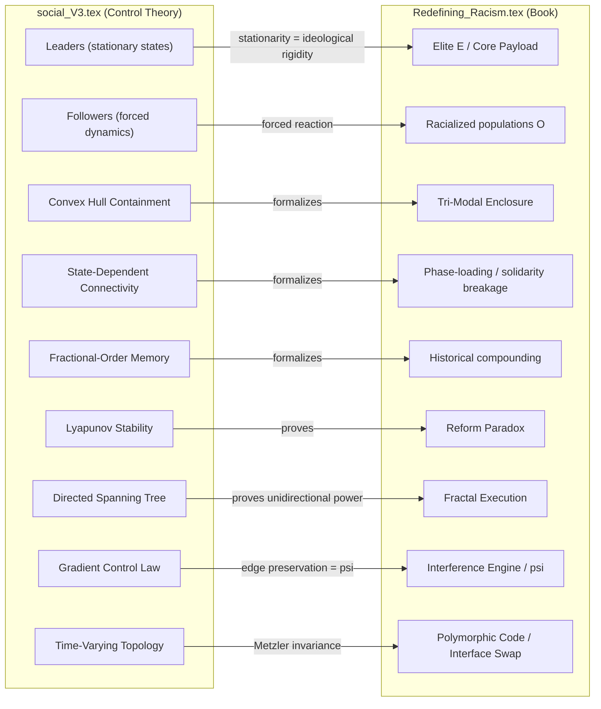
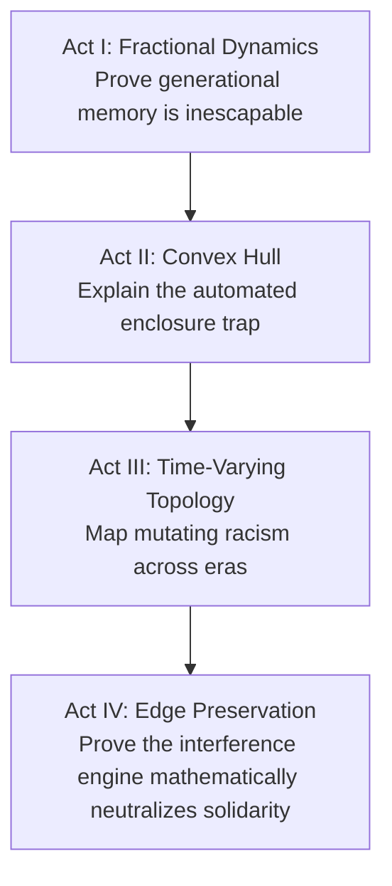

# Integrating Containment Control Theory into The Mathematics of Oppression

## Why This Works

The social_V3 paper provides **formal multi-agent control theory on directed graphs** — the exact mathematical backbone that [Redefining_Racism.tex](Paper/Redefining_Racism.tex) currently lacks. The book already uses "containment" as a central metaphor (Ch. 7 title, redlining, global containment field) and has optimization/threshold language, but without graph Laplacians, agent dynamics, or stability proofs. The mapping is natural and deep:



---

## Ten Integration Points

### 1. New Section: "The Formal Containment Model" (insert in Chapter 7 or as new Chapter 7.5)

**Location:** After the current narrative of redlining/containment in [Ch. 7 (~lines 2704-3391)](Paper/Redefining_Racism.tex) but before the phase-loading algebra.

**What to add:**
- Introduce the directed graph `G = (V, E)` with `V = V_L ∪ V_F` where leaders `V_L` map to `E` (Elite) and followers `V_F` map to `O_racialized ∪ I_buffer`
- State `q_i(t) ∈ R^d` as social/economic position (wealth, autonomy, political influence)
- The **containment objective**: followers converge to `Co(q^L)` — the convex hull set by elite actors — formalizing the book's existing claim that the system constrains populations within "acceptable" bounds
- **Convex hull as Tri-Modal Enclosure**: The convex hull `Co(q^L)` maps directly to the Tri-Modal Enclosure Model (`E_score = 1/3 Σ e_i`). The leaders' positions define the bounding vertices; the enclosure score measures how tightly the hull constrains follower states. Systemic domination does not require micromanaging every individual node — the ruling class simply establishes the bounding vertices, and the containment algorithm does the rest
- Cite as: the framework from social_V3 (add to bibliography as a `\bibitem`)

**Key equation to adapt:**
```
_0 D_t^α q_i(t) = u_i(t), i = 1,...,n
```
where `u_i = -K_i ∇_{q_i} φ_i` represents institutional pressure (policy instruments `P_spatial`, `P_criminal`, etc.)

### 2. State-Dependent Connectivity as Solidarity Fragmentation (enhance Phase-Loading Algebra)

**Location:** The existing phase-loading section [~lines 3088-3155](Paper/Redefining_Racism.tex) (`\ref{sec:phase_loading_algebra}`).

**What to add:**
- The delta-threshold model: edge `(i,j)` exists iff `||q_i - q_j||^2 ≤ δ` — people can only influence each other when their social states are "close enough"
- **COINTELPRO as edge-breaking**: deliberately increasing `||q_i - q_j||` beyond `δ` to sever coalition bonds (already discussed narratively; now has a formal mechanism)
- The navigation function `φ_i = γ_i / (γ_i^k + β_i)^{1/k}` where `β_i` encodes the connectivity constraint — agents are driven apart but the system must avoid *complete* disconnection (needs some hierarchy to persist)
- Connect to existing `Φ_load = 1 - |N^{-1} Σ_j e^{iΦ_j}|`: show that high phase-loading corresponds to large `||q_i - q_j||` pushing edges past `δ`, fragmenting the network
- **The self-sustaining trap**: Once the threshold conditions hold, the followers *maintain the trap themselves*. The containment is not purely externally imposed — state-dependent connectivity means that once populations are driven far enough apart, their own social distance sustains the fragmentation without continuous elite intervention. The algorithm is self-enforcing

### 3. Stationary Leaders as "The Core Payload" (enhance Ch. 1 and Ch. 7)

**Location:** Ch. 1 "Core Payload: A Resource-Mining Rootkit" and the new formal section in Ch. 7.

**What to add:**
- In social_V3, leaders obey `_0 D_t^α q_i = 0` — they are mathematically **stationary**. They do not change, adapt, or negotiate. Followers obey `_0 D_t^α q_i = u_i` — they are mathematically **forced into constant dynamic reaction**
- This is not a modeling convenience; it is the formal expression of the book's thesis about the Elite: the "Core Payload" does not compromise. The ideological and material position of the ruling class is the **fixed point** of the system. Everyone else must adjust to it
- The power asymmetry is encoded in the differential equations themselves: leaders have zero dynamics, followers have nonzero dynamics with a control input designed to drive them toward the leaders' hull
- Connect to the book's "dynamic state" and "Bayesian Defense" — the oppressed are in perpetual reaction because the system's architecture demands it; the leaders' stationarity **is** the architecture

### 4. Directed Spanning Tree as Proof of Unidirectional Power (formalize "Fractal Execution")

**Location:** Ch. 1 "Fractal Execution: The Self-Similar Architecture" and Ch. 8 "The Complete Algorithm."

**What to add:**
- social_V3 Assumption 1 requires a **directed spanning tree** rooted at leaders: there exists a one-way path of influence from at least one leader to every follower, but **no path flows backward**
- This is the geometric proof of the book's central structural claim: power and subjugation flow downward from the root (system architects) through institutional branches (buffer classes, local authorities, enforcement) to the marginalized nodes
- The **directed** nature of the edges proves formally why marginalized communities cannot use the system's own institutions to dismantle the system — the graph topology does not permit influence to propagate upward to the root
- Theorem 1 guarantees this spanning tree structure is **preserved for all time** under the control law — the hierarchy is self-maintaining
- Map the tree layers: Root = `E` (Elite), internal nodes = `I_buffer` and `F_enforce`, leaf nodes = `O_racialized`

### 5. Edge Preservation and the Interference Engine (formalize Section 6.6.2)

**Location:** Section 6.6.2 "The Interference Engine" and the phase-loading algebra in Ch. 7.

**What to add:**
- The gradient control law `u_i = -K_i ∇_{q_i} φ_i` actively monitors and manages social differences between nodes. The navigation function `φ_i` balances two competing objectives: driving followers toward alignment with leaders (goal term `γ_i`) while preventing edges from breaking (connectivity term `β_i`)
- **Edge preservation = preserving the psychological wage (psi)**: The specific "edge" the Elite preserves is the bond between the buffer class and the elite. If `||q_{buffer} - q_{racialized}||` shrinks below some solidarity threshold, the buffer class might align with the out-group. The system's gradient control law is the injection of **phase shifts** along identity axes to prevent this
- **Gradient control as noise cancellation**: The control input `u_i` maps directly to the Interference Engine — the Elite's algorithmic injection of `Φ_load` across intersecting identity axes (race, gender, orientation). By keeping `I_buffer` and `O_racialized` out of phase, their combined solidarity wave undergoes destructive interference, flattening `S_total << τ`
- The `δ` threshold has dual meaning: too much distance and edges break (losing hierarchy); too little distance and solidarity forms (threatening `τ`). The system must maintain a **Goldilocks zone** — enough division to prevent coalition, not so much that the network fragments entirely
- **Lyapunov function as energy ceiling**: Use the paper's Lyapunov function proofs to show that the solidarity energy `V(x)` is mathematically bounded — `V̇ ≤ 0` guarantees the combined kinetic potential of class alignment *never* breaches the collapse threshold `τ`. This turns the interference engine from a sociological observation into a mathematical certainty: the energy of the masses is provably neutralized
- Synthesizing sentence for the book: "The Fractal Interference Engine operates on the precise principles of decentralized containment control. To maintain the directed spanning tree, the system executes constant edge preservation by injecting compound phase shifts across intersecting identity axes — an active noise-cancellation algorithm that mathematically guarantees the system never breaches the collapse threshold τ."

### 6. Time-Varying Topology as "Polymorphic Code / Interface Swap" (formalize Ch. 8)

**Location:** Ch. 8 "The Complete Algorithm" — particularly the narrative of system mutation across eras.

**What to add:**
- social_V3 tackles a key mathematical challenge: maintaining containment when the network **topology constantly shifts** (time-varying weights, state-dependent edge creation/deletion). The specific edges and weights change, but the **Metzler matrix conditions** (off-diagonals nonneg, zero row sums) and the spanning tree structure guarantee the same convergence outcome
- This is the formal representation of "Polymorphic Code: The Interface Swap" — the system's interfaces mutate across eras (chattel slavery -> Black Codes -> Jim Crow -> redlining -> War on Drugs -> mass incarceration -> algorithmic bias) but as long as the Metzler matrix conditions and the spanning tree hold, the containment outcome (`q_followers -> Co(q^L)`) is **mathematically identical**
- The specific `m_{ij}(t)` weights (nonnegative, time-varying) represent the changing mechanisms of control: they shift from whips to laws to redlines to algorithms, but the matrix structure (who influences whom, in which direction) remains invariant
- **Counter-argument and rebuttal (active recalculation vs. passive decay)**: A skeptic could argue the system naturally decays over time as topology shifts. The paper's decentralized influence method refutes this: the gradient control law *actively recalculates* containment whenever an edge changes. Like rewiring an old house — the physical switches get swapped out across decades, but the current actively recalculates to keep the front door permanently locked. The trap does not passively persist; it dynamically rebuilds itself
- Key formal claim: **Theorem 2 holds for all time-varying Metzler systems with spanning tree** — the system does not need a fixed topology to achieve containment. This is the mathematical proof that the "interface swap" is a feature, not a bug

### 7. Fractional-Order Dynamics as Historical Memory / Compounding (enhance compounding model)

**Location:** The existing compounding model in [Ch. 6 (~lines 2145-2702)](Paper/Redefining_Racism.tex) where `O_t^capacity = O_{t-1}(1-αP_t)`.

**What to add:**
- The Caputo fractional derivative `_0 D_t^α` with `α ∈ (0,1)` encodes **non-Markovian memory** — the system's evolution depends on its *entire history*, not just the current state
- This is the formal version of the book's compounding argument: enslavement → Jim Crow → redlining → mass incarceration are not independent shocks but accumulate through a **memory kernel**
- The Mittag-Leffler stability bound `||x(t)|| ≤ {m(x(t_0)) E_{α,1}(-λ(t-t_0)^α)}^b` shows convergence is **power-law slow** (not exponential) — mathematically proving that historical damage decays far more slowly than reformers assume
- **Permanent trajectory deformation**: Mittag-Leffler stability proves something stronger than slow decay — it proves that initial trauma *permanently alters the follower's trajectory*. Like a rubber band stretched past its elastic limit: it permanently loses its elasticity and can never snap back to its original shape. The Middle Passage, the compounding of enslavement, redlining, and mass incarceration are not recoverable shocks — they are *permanent deformations of the state trajectory*. You mathematically cannot analyze the system without its historical timeline
- Directly cite Theorem 3 from social_V3 for the fractional convergence result

### 8. Lyapunov Stability Analysis as Proof of the Reform Paradox (formalize Ch. 9)

**Location:** [Ch. 9 (~lines 6160-6782)](Paper/Redefining_Racism.tex), particularly the Concession Theorem and Reform Paradox.

**What to add:**
- Theorem 2 from social_V3 (integer-order convergence): followers asymptotically converge to `Co(q^L)` — **the system is Lyapunov stable toward the elite's desired configuration**
- Reinterpret: "reforms" are perturbations to follower states `q_i`; Lyapunov analysis guarantees the system **returns to the containment set** regardless of these perturbations
- The key insight: `V̇ ≤ 0` means the "volume" of freedom (deviation from elite-defined bounds) monotonically shrinks — this is the Reform Paradox stated as a stability theorem
- Spanning tree maintenance (Theorem 1) proves the **hierarchical structure itself is preserved** — the control law ensures power relations (directed edges) never break
- This gives the existing informal claim `Δmax = 0` a rigorous foundation
- **Mittag-Leffler stability as "The Backlash Constant"**: Synthesize the paper's Mittag-Leffler stability analysis with the existing "Fractal Computer Virus" architecture to show how the oppressive network naturally self-corrects against exogenous shocks (uprisings, reform movements), continually returning the marginalized to the containment set — the mathematical formalization of "backlash"

### 9. Zachary Karate Club as Social Microcosm (add to Simulations/Examples)

**Location:** Could go in a new appendix or within the enhanced Ch. 7 section.

**What to add:**
- The social_V3 paper already uses a Zachary Karate Club subgraph (3 leaders, 7 followers) with convergence to the convex hull
- Reframe: the two faction leaders (Mr. Hi, Officer) as competing "elites" with the 34 members as followers whose social positions converge into the convex hull bounded by leader positions
- This provides an **empirical micro-model** of the book's thesis: even in a small social network, structural position (leader vs follower in the directed graph) determines where agents end up, regardless of individual "choices"
- The simulation figures (trajectory convergence) can be adapted as book figures

### 10. Bibliography and Citation Integration

**Location:** [Bibliography starting ~line 7552](Paper/Redefining_Racism.tex).

**What to add:**
- A `\bibitem` for the social_V3 paper (the Restrepo, Loizou, and Generazio paper)
- Cross-references to supporting citations already in social_V3 that the book doesn't have: Zachary (1977), Li et al. (2009) on Mittag-Leffler stability, Moreau (2005) on consensus, Khalil (2002) on Lyapunov theory
- These strengthen the mathematical credibility of the book's formal sections

---

## Narrative Arc (Four-Act Proof Structure)

The notebook review identifies a natural argumentative sequence that the integration should follow. Each act builds on the previous one:



- **Act I** (Points 3, 7): Establish that the system has *memory* — fractional dynamics prove you cannot analyze it without its full history. The Bayesian Defense becomes a theorem, not a metaphor.
- **Act II** (Points 1, 4): With memory established, show that the system uses it to build an *automated trap* — the convex hull containment. Leaders set boundary vertices; decentralized algorithms do the rest. The Tri-Modal Enclosure becomes a proved geometric object.
- **Act III** (Points 2, 6): With the trap established, show it *survives mutation* — time-varying topology proves the interface swap preserves containment even as mechanisms change across centuries. The trap actively recalculates, never passively decays.
- **Act IV** (Points 5, 8): The climax — show how the system *prevents its own destruction*. Gradient control laws as noise cancellation, Lyapunov functions as energy ceilings, edge preservation as the mathematical machinery that keeps the collapse threshold forever out of reach.

This arc takes the reader from "the system remembers" to "the system traps" to "the system adapts" to "the system is mathematically indestructible without topological surgery" — arriving at the book's existing conclusion that only *structural* change (changing the graph topology itself, not the weights) can break the containment.

---

## Proposed Figures (8 New Diagrams)

The book already has 30+ tikz/pgfplots figures with a consistent visual language: red for oppression/extraction, blue for control/enforcement, black/gray for elite, orange for buffer class, and dashed red lines for the collapse threshold `τ`. All new figures should follow this palette and style.

### Figure A: "The Directed Spanning Tree of Oppression" (tikz, Point 4)
**Location:** New formal section in Ch. 7, cross-referenced in Ch. 1 and Ch. 8.

A directed graph (not the existing pyramid) showing the same 5-tier hierarchy as a **tree rooted at E**. Directed edges point exclusively downward: `E → P_uppet → F_enforce → I_buffer → O_racialized`. Key visual: arrows are one-way; no edge points upward. Annotate: "Influence cannot propagate upward — the graph topology prevents it." This complements the existing pyramid (Figure at ~line 2555) by showing the same structure as a formal graph-theoretic object, directly citing social_V3's Assumption 1.

### Figure B: "Convex Hull Containment — The Automated Trap" (tikz + pgfplots, Point 1)
**Location:** New formal section in Ch. 7 / Tri-Modal Enclosure discussion.

A 2D scatter-style plot adapted from social_V3's Trajectory2: three large **black squares** at the vertices of a shaded convex hull (the leaders / Elite positions in social-economic state space). Multiple **red dots** with trajectory arrows converging from scattered initial positions into the hull. Label the hull interior "Enclosure Zone: `Co(q^L)`" and the exterior "Forbidden Zone" (unreachable by followers). Caption connects `Co(q^L)` to `E_score` and the Tri-Modal Enclosure: "The Elite sets the boundary vertices. The decentralized algorithm traps the rest."

### Figure C: "Fractional vs. Exponential Decay — The Memory Gap" (pgfplots, Point 7)
**Location:** Ch. 6, alongside the compounding model.

Two overlaid decay curves on the same axes:
- **Dashed gray curve**: `e^{-λt}` (exponential decay, integer-order — "what reformers assume")
- **Solid red curve**: `E_{α,1}(-λt^α)` with `α = 0.5` (Mittag-Leffler, fractional-order — "actual historical memory")

X-axis: "Generations Since Initial Trauma." Y-axis: "Residual System Memory." The gap between the curves widens dramatically over time. Annotate the gap at generation 5-10: **"The Memory Gap: damage that should have decayed persists indefinitely."** A vertical dashed line at the present marks "We are here" — showing the fractional curve still at substantial magnitude while the exponential curve has essentially hit zero. This is the single most powerful chart for the "rubber band past its elastic limit" argument.

### Figure D: "Time-Varying Topology — The Interface Swap" (tikz, Point 6)
**Location:** Ch. 8 "The Complete Algorithm."

A horizontal sequence of **four small directed graphs**, each with the same node set (`E`, `I`, `O`) but with different edge structures and weights:
1. **Slavery (1619-1865)**: thick edges labeled `P_chattel`, direct enforcement
2. **Jim Crow (1877-1965)**: different edges labeled `P_spatial`, `P_grandfather}`
3. **War on Drugs (1971-Present)**: edges labeled `P_criminal`, `P_WarOnDrugs`
4. **Algorithmic (2010-Present)**: edges labeled `P_algorithmic`, `P_debt`

Below all four: a single shared **shaded convex hull** showing followers in the same containment region across all four eras. Caption: "The edges change. The weights change. The containment is mathematically identical. (Theorem 2: Metzler invariance.)"

### Figure E: "The Goldilocks Zone — Edge Preservation Dynamics" (pgfplots, Point 5)
**Location:** Section 6.6.2 / Interference Engine, or new Ch. 7 section.

A horizontal axis showing `||q_{buffer} - q_{racialized}||` (social distance between buffer class and out-group). Three color-shaded regions:
- **Left (green, danger zone)**: "Solidarity Zone" — distance too small, coalition forms, `S_total` approaches `τ`
- **Center (blue, safe zone)**: "Managed Zone" — edges preserved, solidarity suppressed, system stable
- **Right (red, danger zone)**: "Fragmentation Zone" — `||q_i - q_j|| > δ`, edges break, hierarchy collapses

Two vertical dashed lines mark the boundaries. Annotate the managed zone: "The system's gradient control law maintains this band." This visualizes the dual constraint the elite must satisfy.

### Figure F: "Lyapunov Energy Ceiling — Why Solidarity Never Breaches τ" (pgfplots, Point 8)
**Location:** Ch. 9, Reform Paradox section.

A time-series plot of `V(x(t))` (solidarity energy) as a generally decreasing function, with a **dashed red line** at `τ` (same style as the existing oscilloscope figure). Show 3-4 small upward "bumps" labeled "Reform 1", "Civil Rights Act", "Obama Era" — perturbations that temporarily increase V, but are immediately absorbed back down by the control law (`V̇ ≤ 0`). The curve trends asymptotically toward `Co(q^L)`. Caption: "Lyapunov stability guarantees `V̇ ≤ 0`: every reform perturbation is absorbed. The system returns to the containment set."

### Figure G: "The Self-Sustaining Trap" (tikz, Point 2)
**Location:** Phase-loading algebra section, Ch. 7.

A **two-panel** diagram:
- **Left panel ("Phase 1: External Imposition")**: Elite nodes (black) actively pushing blue (buffer) and red (out-group) nodes apart with labeled force arrows. Edges still connect all nodes. Label: "COINTELPRO, Tweedism"
- **Right panel ("Phase 2: Self-Sustaining")**: Elite nodes idle. Buffer and out-group nodes maintain their own separation — no edges connect them because `||q_i - q_j|| > δ`. Label: "Algorithm self-enforcing. No further intervention required."

Arrow between panels: "Once `||q_i - q_j|| > δ`, the trap maintains itself." This visualizes why the system doesn't need perpetual active management.

### Figure H: "The Zachary Karate Club — A Social Microcosm" (tikz, Point 9)
**Location:** New appendix or Ch. 7.

Redraw the Zachary Karate Club directed subgraph from social_V3 using the book's color palette: 3 leader nodes as **large black squares** (labeled `E_1, E_2, E_3`), 7 follower nodes as **small red/orange circles** (labeled with `O` and `I` prefixes). Directed edges in the book's arrow style. Overlay a shaded convex hull around the leaders with follower trajectories converging into it. Caption: "Even in a 10-node social network, structural position — not individual choice — determines the final state."

---

### Figure Priority

If implementation time is limited, the highest-impact figures in order:

1. **Figure C (Memory Gap)** — The most visually striking and argumentatively powerful
2. **Figure B (Convex Hull)** — The core visual metaphor of the entire integration
3. **Figure D (Interface Swap)** — Proves the mutation argument across eras
4. **Figure E (Goldilocks Zone)** — Makes the edge preservation argument intuitive
5. **Figure F (Lyapunov Ceiling)** — Directly echoes the existing oscilloscope figure style
6. **Figure A (Spanning Tree)** — Complements the existing pyramid
7. **Figure G (Self-Sustaining Trap)** — Clean two-panel explanation
8. **Figure H (Karate Club)** — Empirical anchor, adapted from social_V3

---

## Structural Approach

The integration should **not** create a standalone "math chapter" that feels disconnected. Instead:

- **Weave formal results into existing narrative sections** where the informal claims already live
- **Use the book's existing notation** (`E`, `O`, `M(t)`, `P_{...}`) and show how social_V3's formalism instantiates it
- **Add a dedicated subsection** (2-3 pages) in Chapter 7 that introduces the graph-theoretic framework, then reference it forward in Chapters 8, 9, and 10
- **Add a formal appendix** with the full mathematical development (proofs adapted from social_V3) for readers who want rigor, keeping the main text accessible

---

## Files to Modify

- [Paper/Redefining_Racism.tex](Paper/Redefining_Racism.tex) — main integration target (new sections, enhanced existing sections, bibliography)
- Potentially create a new appendix file if the formal development grows large enough to warrant separation
