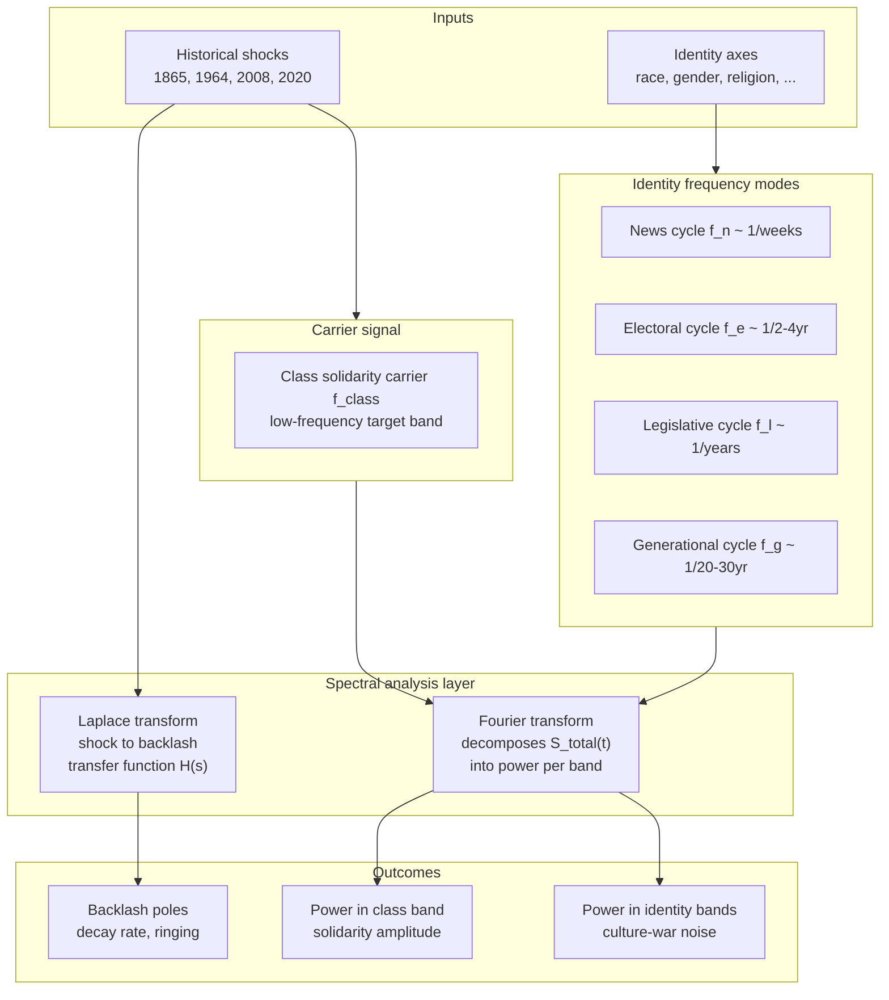

# Empirical Hardening and Spectral Rewrite

## Context

The manuscript currently has ~97 labeled equations across 17 chapters plus conclusion and appendix. Roughly 15 equations already have empirical anchors (Piketty-Saez-Zucman, Gilens-Page, ACLU cannabis, Reyes lead-crime, Alsan-Wanamaker, Zachary karate, Haiti 80% debt, Tulsa). The remaining ~82 are ordinal/structural/analogical. The book already declares (line 140) that equations are "precision-forcing devices, not measurement instruments." This program upgrades that stance from disclaimer to demonstration.

Two hard structural tensions in the current text will be resolved in passing:

- **Interference Engine figure-vs-equation mismatch.** `eq:40`-`eq:44` fix a single `f_class` for all subgroups, but `fig:fractal-oscilloscope` (`Paper/Redefining_Racism.tex:4334-4344`) plots gender and orientation at `1.5*x` and `0.5*x` multipliers. Model C resolves this: class carrier persists; identity axes have their own frequencies.
- **Ch. 15-17 plan drift (resolved 2026-04-21).** `.cursor/plans/chapter-15-17-post-grok-hardening_a9c4d2e1.plan.md` previously left `ch15-17-emergent-fractures` unchecked while `Paper/Redefining_Racism.tex` (approx.\ lines 9504–9510, 9527–9528) already contained both fixes; the chapter plan and Phase~0 todo are now reconciled.

## Architecture (Model C Hybrid Temporal-Spectral)



- Class solidarity remains the forbidden frequency (Preface line 118 stays intact).
- Interference Engine's job becomes: move spectral power out of the class band and into identity bands.
- Parseval's theorem gives "political energy conservation" — total variance is conserved, the engine only redistributes it.
- Damped oscillator (`Paper/Redefining_Racism.tex:8923`) gets its Laplace transfer function `H(s) = 1/(s² + Δs + ω₀²)` with poles as backlash timescales.

## Calibration Anchors (Methodology Spine)

Two historical events define the ρ_τ = 1.0 reference point:
- **Bacon's Rebellion (1676).** Cross-racial class coalition; crash triggered Virginia slave codes. Already quantified in `Paper/Redefining_Racism.tex:1245-1254` (Φ_load ∈ [0.15, 0.55], ρ_τ > 1.00 at crash).
- **Haitian Revolution (1791-1804).** Kinetic threshold breach under weakest phenotypic/class differentials of any American slaveholding society. Indemnity 150M→90M francs, up to 80% of national budget through 1947 (`Paper/Redefining_Racism.tex:1660-1666`).

All other events get ρ_τ interval estimates anchored to these two, with Tier 1–3 confidence flags (format already defined in appendix at `Paper/Redefining_Racism.tex:9828-9843`). This is **ordinal estimation with numerical weights**, not cardinal measurement, and this is defensible — it's how Polity IV, V-Dem democratic-regime scoring, and the Correlates of War project operate.

## Phased Implementation

### Phase 0 — Close existing drift (1-2 sessions)
- Reconcile `.cursor/plans/chapter-15-17-post-grok-hardening_a9c4d2e1.plan.md` with the prose already in the text (lines 9504-9510, 9527-9528). Mark todos complete.
- Full-manuscript Grok synthesis pass flagged as optional in recent session logs — **deferred** (not required to close Ch.~15–17 drift; pick up if a separate audit artifact is needed).

### Phase 1 — Empirical Methodology chapter (1-2 weeks)
New chapter inserted after the preface, before Ch. 1. File remains `Paper/Redefining_Racism.tex` (monolithic structure). Contents:
- Why sociological estimation is legitimate (cite Polity IV, V-Dem, GSS, ANES, Correlates of War, Piketty datasets, Gallup social cohesion, Bowling Alone social-capital index, Pew polarization series).
- The anchor-and-scale methodology: Bacon + Haiti → ρ_τ = 1.0, all others relative.
- Confidence tier scheme (already in `Paper/Redefining_Racism.tex:9843`, promote to main text).
- Reproducibility standard: every numerical claim in a case study must cite either (a) peer-reviewed source, (b) public dataset with URL, or (c) explicit author-constructed estimate with method disclosed.
- Addresses Grok's "math cosplay" critique at the methodological level before any single equation.

### Phase 2 — Equation registry (1 week)
Create `Paper/empirical_validations/` as a working directory (not compiled into PDF; drives the LaTeX writing).
- One markdown file per equation: `eq_05_kernel_optimization.md`, etc.
- Schema: equation statement, chapter location, type (ordinal/structural/quantitative), existing case study y/n, target historical event(s), data sources, difficulty estimate (S/M/L), author-of-record.
- Populate from the equation catalog already built during research.
- Generates a prioritized queue.

### Phase 3 — Headline equations case studies (4-6 weeks, 12 equations)
Full quantitative case studies inserted as `\subsection*{Case Study: ...}` blocks directly after each equation in `Paper/Redefining_Racism.tex`:

1. `eq:5` kernel optimization max ε s.t. M(t)<τ → antebellum South 1840-1860 (cotton output vs. slave-rebellion suppression budget).
2. `eq:8`-`eq:10` envelope and suppression → post-1965 backlash wave (union density, wealth share, incarceration rate).
3. `eq:20` and `eq:24` Bacon inequality + kinetic necessary condition → Bacon's Rebellion anchor (deepen existing numbers, add the 385k slaveholders vs. 4M enslaved calculation with real time-series).
4. `eq:27` lethal autonomy → police killings per capita by race (Mapping Police Violence dataset, 2013-2024).
5. `eq:33` capacity compounding → ACLU cannabis ratios + redlining HOLC maps + modern school segregation (extend existing).
6. `eq:40`-`eq:45` Interference Engine — deferred to Phase 4 (the spectral rewrite).
7. `eq:46` Tweedism agenda path → Gilens-Page 1,779 policies (already in text, deepen with new replications).
8. `eq:47`-`eq:51` lead-crime + property tax + highway → Reyes + Aizer-Currie + Rothstein replications.
9. `eq:63` O_final set construction → modern mass-incarceration demographics.
10. `eq:65`-`eq:68` kinetic asymmetry + disarmament sequence → Second Amendment case law time-series (Heller, Bruen, Rahimi) with ordinal ρ_τ scoring.
11. `eq:73`-`eq:74` Haitian Theorem → extend beyond Haiti to Liberia, post-colonial Algeria, Zimbabwe (Δmax trajectories).
12. `eq:91` imperial core collapse condition → China, OPEC, Asian Tigers (this closes one of the three Ch. 13 post-Grok todos with real numbers rather than narrative).

Each case study: setup → data sources (with DOI/URL) → operationalization of variables → numerical computation → comparison to equation prediction → falsification criteria → confidence tier.

### Phase 4 — Interference Engine spectral rewrite (2-3 weeks)
Rewrite `Paper/Redefining_Racism.tex:4252-4396` under Model C hybrid:
- Replace `eq:40`-`eq:44` with a hybrid carrier+modes formulation. Proposed new equation:

```latex
S_{\text{total}}(t) = \underbrace{\sum_j A_j(t)\sin(2\pi f_{\text{class}} t + \Phi_j(t))}_{\text{class carrier w/ subgroup phases}} + \underbrace{\sum_k B_k(t)\sin(2\pi f_k t + \psi_k(t))}_{\text{identity mode spectrum}} + \eta(t)
```

- Add new `\subsubsection{Fourier Decomposition: Reading Power Spectrum of Political Attention}` — show how FFT applied to proxy signals (Google Trends "class" vs. "race"/"gender"/"religion" searches 2004-2024; Congressional Record word frequencies; ANES issue-salience series) recovers the class band vs. identity band power distribution. This is the empirical run-the-numbers demonstration Grok demanded.
- Add new `\subsubsection{Laplace Transfer Function: Shock-to-Backlash Dynamics}` — take the damped oscillator at `Paper/Redefining_Racism.tex:8923` and write `H(s) = 1/(s² + Δs + ω₀²)`. Solve for poles. Map four historical shocks (1865, 1964, 2008, 2020) to impulse inputs; compute predicted backlash response; compare to observed (Klan resurgence, Southern Strategy, Tea Party, Jan 6). Poles give decay rate and ringing frequency — real numbers from fitting.
- Fix `fig:fractal-oscilloscope` at `Paper/Redefining_Racism.tex:4334-4344`: either update equations to match the multi-frequency plot (Model C), or update the plot to match single-`f_class` equations (Model A). Under user's choice of Model C, equations change.
- Parseval's theorem paragraph: "political energy conservation" as the formal statement of why the interference engine is a redistribution operator, not a suppression operator.
- Create `Paper/figures/spectral/` directory with four new TikZ/matplotlib-generated figures: power spectrum over time, Laplace-plane pole plot, shock impulse responses, band-power tradeoff chart.

### Phase 5 — Remaining equations (ongoing, bulk of the work, 3-6 months)
Tiered approach for the ~85 remaining labeled equations:
- **Quantitative tier (~30 eqs):** full case-study subsection, same format as Phase 3.
- **Structural tier (~40 eqs):** shorter "illustrative instantiation" paragraph — one historical example, one parameter estimate, confidence tier, no full derivation.
- **Ordinal tier (~15 eqs):** one-sentence footnote linking to the methodology chapter's disclaimer.

Work chapter-by-chapter in manuscript order. Each completed chapter gets a git commit and session log under `__Avenue/harper/logs/`.

### Phase 6 — Cross-reference and empirical index (1-2 weeks)
- New appendix `\chapter{Empirical Validation Index}` at end of manuscript: every equation → case study location (line number) → confidence tier → primary data source → falsification criterion.
- Update abstract (`Paper/Redefining_Racism.tex` frontmatter around line 74 where user cursor is) to reflect the empirical upgrade.
- Update line 140 genre paragraph: keep "precision-forcing devices" phrase but add "calibrated against ... anchor cases" — the disclaimer becomes a methodology statement.
- Cross-reference every ρ_τ interval estimate back to Bacon/Haiti anchors.

### Phase 7 — Validation packet (1 week)
- Standalone companion document for peer review: `Paper/Empirical_Validation_Companion.tex` listing the ~50 case studies with replication data pointers, code (where any was written), and a critique-response appendix updating Grok's audit.
- `.bib` additions for every new citation.

## Files and Directories Affected

- `Paper/Redefining_Racism.tex` — main manuscript (extensive edits across all chapters).
- `Paper/empirical_validations/` — new, working directory of per-equation markdown notes.
- `Paper/figures/spectral/` — new, FFT and Laplace figures.
- `Paper/data/` — new, curated datasets (CSV/JSON) used in case studies.
- `Paper/scripts/` — new, Python/R analysis scripts producing numbers cited in case studies.
- `Paper/Empirical_Validation_Companion.tex` — new standalone companion document (Phase 7).
- `.cursor/plans/chapter-15-17-post-grok-hardening_a9c4d2e1.plan.md` — reconcile in Phase 0.
- `__Avenue/harper/logs/` — session logs per existing rule.

## Deliverables Per Phase (for progress tracking)

- Phase 0: plan reconciliation; optional full-manuscript Grok synthesis doc.
- Phase 1: ~10-page methodology chapter in main tex.
- Phase 2: equation registry (~97 markdown files).
- Phase 3: 12 headline case study subsections inserted into tex.
- Phase 4: Interference Engine + spectral analysis subsections; 4 new figures.
- Phase 5: ~85 remaining case studies (tiered).
- Phase 6: empirical index appendix; preface update.
- Phase 7: companion document.

## Decision Points Within the Plan

1. **After Phase 3:** Is the empirical approach convincing enough to continue to ~85 more cases, or does the methodology need adjustment?
2. **During Phase 4:** Does the Model C Fourier/Laplace rewrite hold up against real Google Trends / ANES data, or does a different decomposition (wavelet, empirical mode) fit better?
3. **After Phase 5 tier split:** Are the "ordinal tier" equations pulling weight, or should they be cut entirely?
4. **Before Phase 7:** Which external reviewers (academic, journalistic, sociological, quantitative) get the companion document first?

## Risks

- **Time.** ~6-9 months full program. Phases 1-4 (~2 months) are the minimum credible Grok response.
- **Data availability.** Some historical events (especially pre-1900) genuinely lack numeric sources. Tier 3 ordinal handling with explicit disclaimer is the safety valve.
- **Quantification accusation reversal.** Overcommitting to cardinal measurements risks the opposite critique ("spurious precision"). Anchor-and-scale methodology with confidence tiers mitigates this.
- **Interference Engine rewrite breaks existing citations.** Equation labels `eq:40`-`eq:45` are referenced downstream; rewrite must preserve label names or update all callsites (grep shows these labels referenced in Ch. 6, Ch. 15, and the appendix runtime log at line 9897).
- **Bacon/Haiti as anchors are themselves contestable.** Methodology chapter must preemptively defend why these two events define ρ_τ = 1.0 (answer: they are the two events where the kinetic threshold unambiguously broke).