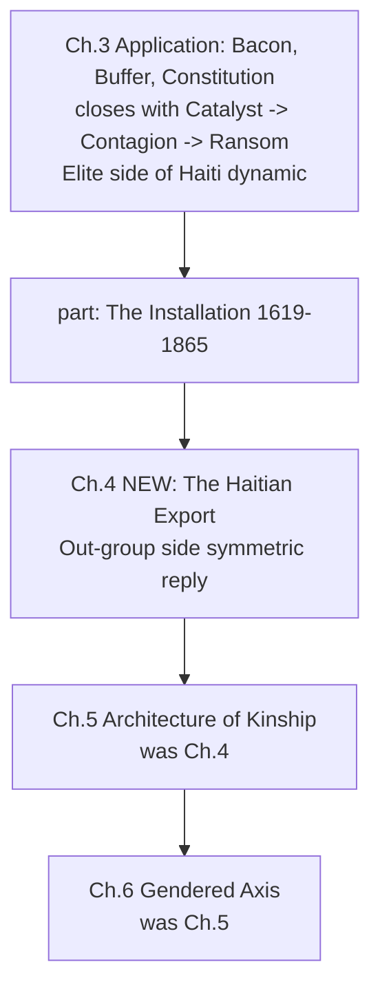

# Haitian Export Chapter Integration

## Objective
Convert the four distinct analytical threads in [`Sources/Haiti's Post-Revolutionary Influence.md`](Sources/Haiti's Post-Revolutionary Influence.md) that are *not* yet in [`Paper/Redefining_Racism.tex`](Paper/Redefining_Racism.tex) into a single new chapter that reads as the Out-group's symmetric reply to the Elite containment regime documented at the end of Chapter 3. The four threads:

1. Haiti as active material exporter of revolution (Bolívar, Mina, Geffrard, Boyer).
2. Vexillological lineage (Arcahaie → Jacmel → Gran Colombia / DR / Puerto Rico).
3. The Môle Saint-Nicolas Gambit (1891) — Firmin as diplomat.
4. CIC double-debt compounding (1825–1915) as the commercial pretext for the 1915 occupation.

Already in the manuscript and therefore *not* to be re-established (only cross-referenced):
- Haitian Theorem + Polish Proof + Defection Cascade (Ch. 14).
- Firmin as anthropologist (Ch. 2, `line 1382`).
- 1825 Sovereign Ransom / `P_debt` (Ch. 3, `line 1873`).
- 1915 Occupation / corvée / National City Bank (Ch. 5, `line 3726`).
- Hispaniola Natural Experiment eq. 12.7–12.8 (`line 9693`).
- Dessalines's 1805 constitutional redefinition of "Black" as ideological (Ch. 14, `line 11245`).

## Placement and numbering

Insert the new chapter as **Ch. 4, the first chapter of `\part{The Installation (1619--1865)}`**, at [`Paper/Redefining_Racism.tex` line 1882](Paper/Redefining_Racism.tex) — immediately after Chapter 3's current closing section `\section{The Sovereign Ransom and the $P_{\text{debt}}$ Variable}` (`line 1873`) and immediately *after* the `\part{The Installation (1619--1865)}` directive on `line 1882`. The existing `\chapter{The Architecture of Kinship...}` (`line 1885`) shifts from Ch. 4 to Ch. 5; the two subsequent chapters renumber automatically via LaTeX counters.

The chapter's temporal scope (1803–1915) sits cleanly inside Part II's declared range (1619–1865 is already stretched by `line 3726`'s 1915 occupation coverage, so 1915 precedent is established).

Rationale for head-of-Part-II placement rather than end-of-Ch.-3:
- Ch. 3's closing sections (Catalyst 1803, Contagion 1822, Ransom 1825) are the *Elite-side* response. The new chapter is the *Out-group-side* export. Placing them on opposite sides of the Part boundary makes the symmetry structural.
- Part II opens with the Out-group's first sovereign act (Haitian export) before the flashback chapter (Kinship) establishes the pre-colonial baseline that made that act possible.

## Chapter structure

Title: `\chapter{The Haitian Export: Hemispheric Liberation, Vexillological Contagion, and the Firmin Protocol (1803--1915)}` with `\label{ch:haitian_export}`.

Opening RUNTIME LOG `tcolorbox` in the style already established at [`Paper/Redefining_Racism.tex` line 1888](Paper/Redefining_Racism.tex) (West Africa log), keyed to "HAITI (1803–1915)" with variables `E_{\text{global}}`, `O_{\text{emancipated}}`, `F_{\text{enforce}}`, `P_{\text{debt}}`, and the kinetic/semantic/vexillological/diplomatic export vectors.

Seven sections, cross-referenced throughout to the existing scaffolding:

- `\section{The Inverse Contagion: From Quarantine Target to Active Vector}` — frames the chapter as the dual of `\ref{sec:haitian_contagion}` (`line 1839`). States that once $O_{\text{emancipated}}$ becomes sovereign, the Haitian Theorem predicts it will weaponize its own autonomy — the export function.
- `\section{The Consumptive Extraction Function: Quantifying the Kernel Haiti Destroyed}` — short, quantitative: 10.7 M Middle-Passage survivors; Caribbean 35 %; 2–5 %/yr natural decrease; 7–10 yr biological burn; Saint-Domingue 1767 = 72 M lb sugar, 1⁄3 of Atlantic trade, more revenue than all 13 colonies to Britain. Anchors `\max` capital extraction empirically so §§4.3–4.5 can measure against it.
- `\section{Pétion's Condition: Abolition as Counter-Payload}` with four dated subsections: Bolívar (1815–1816), Mina (1816–1817), Geffrard/DR (1863–1865), Boyer/Greece (1822). One `historicalsource` `tcolorbox` quoting Pétion's letter to Bolívar. One `longtable` summary reproducing the source's second table (Independence Movement / Year / Head of State / Material Aid / Conditions-Outcomes). Subsection on Bolívar's betrayal + the 1826 Panama Congress exclusion, framed explicitly as the hemispheric instance of the Complicity Trap (`\ref{sec:complicity_trap}` at `line 1855`).
- `\section{Vexillological Contagion: The Geometry of the Contagion}` with four subsections: Arcahaie 1803 (Dessalines tears the white band, Catherine Flon stitches), Jacmel 1806 (Miranda's *Leander* tricolor), Trinitaria 1844 (DR), *Grito de Lares* 1868 (PR). Reads the Arcahaie act as the *visual* precursor of the 1805 constitutional redefinition of "Black" already documented at `line 11245`. One TikZ lineage tree (see Figures below). One `historicalsource` tcolorbox for the Arcahaie ceremony.
- `\section{The Môle Saint-Nicolas Gambit (1891): The Firmin Protocol}\label{sec:firmin_protocol}` — Firmin (same figure as `line 1382`, now as diplomat) stalls Admiral Gherardi's armed squadron by demanding credentials and invoking the invalidity of treaties-under-duress. Frame: legalistic defection cascade — weaponizing $E$'s own legitimation rules against $F_{\text{enforce}}$'s forward deployment. The diplomatic counterpart of the Polish kinetic defection (`\ref{sec:polish_proof}`, `line 11212`). Cross-reference forward to the 1915 occupation (`line 3726`) as $E$'s recursive response to this 1891 repulsion.
- `\section{The Compounded Ransom: The CIC Double-Debt and Pre-Occupation Financial Capture (1825--1915)}` — short. Extends `\ref{sec:...sovereign_ransom}` (`line 1873`) with the CIC (Crédit Industriel et Commercial) private-bank leg that compounded the French state indemnity, and the National City Bank takeover of CIC exposure by 1914. \$21–\$115 B lost-growth range (reusing the NYT investigative series already in [`Paper/references.bib` line ~2905](Paper/references.bib)). Bridges forward to `line 3726`'s occupation section.
- `\section{Synthesis: The Export Chapter as Dual of the Containment Chapter}` — one-page recap with a two-column symmetry table (Elite containment vs. Out-group export), forward pointers to `\ref{sec:hispaniola_natural_experiment}` (`line 9693`) and to the 2023 MSS mission paragraph (`line 9825`).

## Figures

Two new figures, both vector (TikZ/pgfplots — no new raster assets required).

- **Fig 4.1 Flag-lineage tree** — single-column TikZ diagram with Arcahaie 1803 at the root, branching to (a) Jacmel 1806 → Gran Colombia 1819 → {Colombia, Venezuela, Ecuador}; (b) Port-au-Prince 1822 → Trinitaria 1844 (DR) → *Grito de Lares* 1868 (PR). Nodes label year + location + head of state + core chromatic change.
- **Fig 4.2 Export-vs-containment symmetry** — a two-column `tikzpicture` or `tabular` contrasting the six Elite containment mechanisms (embargo, Negro Seamen Acts, literacy bans, Dred Scott, 1825 ransom, 1915 occupation) against the six Out-group export mechanisms (4,000 Pétion rifles, 300 Haitian veterans in Gran Colombia, 25 tons coffee to Greece, DR cross-border sanctuary, Arcahaie flag geometry, Môle Saint-Nicolas diplomatic repulsion).

## Cross-reference updates outside the new chapter (small)

Three one-line updates elsewhere in the manuscript so the new chapter is visible to the existing citations:

- At [`Paper/Redefining_Racism.tex` line 1398](Paper/Redefining_Racism.tex), after the Firmin-censorship paragraph, append: "Firmin's diplomatic instantiation of the same counter-signal is analyzed in `\ref{sec:firmin_protocol}`."
- At [`line 3726`'s 1915-Occupation section opening](Paper/Redefining_Racism.tex), add a forward-reference sentence pointing the reader back to `\ref{ch:haitian_export}` for the pre-1915 export arc and the Môle Saint-Nicolas precedent.
- At [`line 11212`'s Polish Proof opening](Paper/Redefining_Racism.tex), add a sibling-reference sentence: "The diplomatic counterpart of this kinetic defection is documented in `\ref{sec:firmin_protocol}`."

## References

Per the "minimal" citation decision:
- **Reuse existing keys:** `pachonski_polish_haiti`, `pachonski`, `haiti_constitution_1805`, `dubois`, `james_black_jacobins`, `firmin_legacy`, the already-cited NYT investigative series on the 150-million-franc indemnity (`line 2905` of `references.bib`).
- **Add at most 2 new `.bib` entries** (only where a claim cannot be anchored to existing sources):
  - One composite entry for the Pétion–Bolívar material-aid record (AAIHS / Island Luminous / IBW21 synthesis).
  - One entry for the Miranda/Jacmel 1806 vexillological primary — the `crwflags.com` / `mazo4f` record of the *Leander* tricolor hoist.
- The Greek coffee-and-soldiers episode, the Dominican Restoration War, the Arcahaie ceremony, and the Môle Saint-Nicolas Gambit are each anchored to `haiti_constitution_1805`, `dubois`, or the existing NYT investigative series, with a single consolidated footnote pointing to the source document's bibliography for readers who want the full set.

## Build and verification

- Compile check: run `make pdf` after the insertion; confirm chapter counters advance cleanly and no `\ref{...}` is `??`.
- Lint: run the existing SCOTUS-corpus audit script (no SCOTUS cases are added, so it should pass unchanged).
- `ReadLints` on the modified `.tex` after the insert.

## Deferred / not in scope

- The source's image1–image4 base64 PNGs (they encode mathematical symbols already rendered natively in the manuscript).
- A standalone Pétion letter facsimile figure — the `historicalsource` tcolorbox is sufficient at minimal-citation depth.
- Translation of the export framing back into a formal theorem statement (e.g., "Export Theorem"). Can be added in a later pass if you want it to sit alongside the Haitian Theorem and the Defection Theorem.
