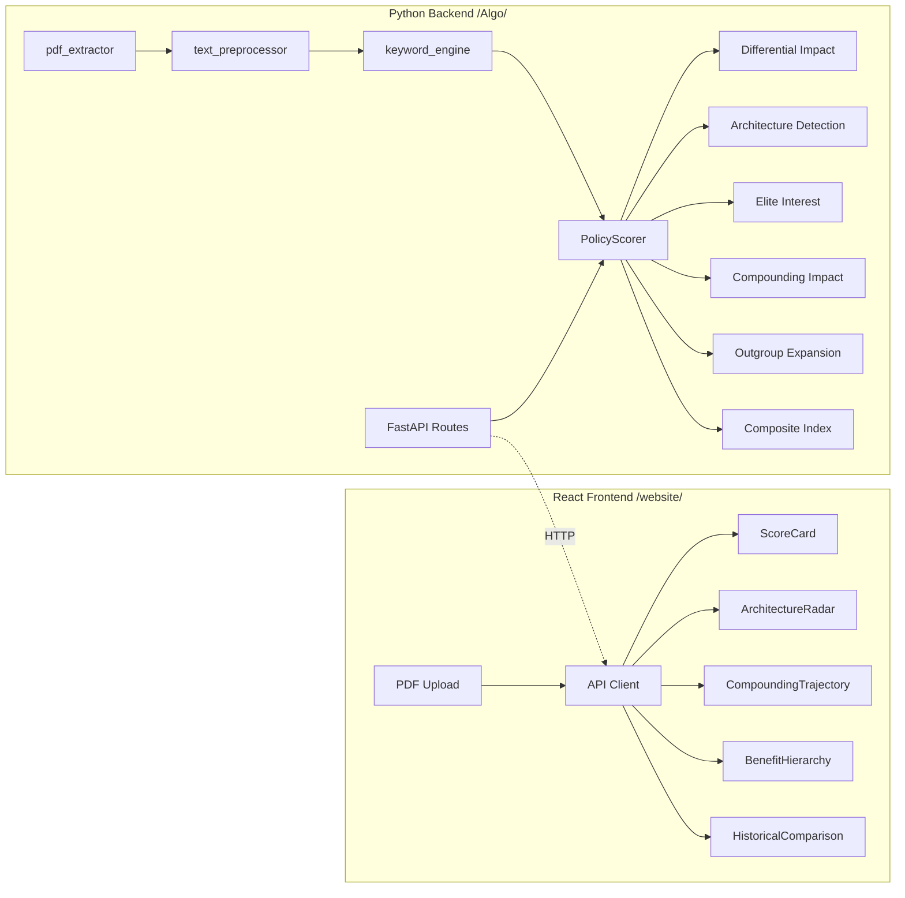

# Oppression Algorithm: Policy Scoring Engine + Frontend

## Current State

- **Paper**: [Redefining_Racism.tex](Redefining_Racism.tex) -- defines three groups (E, I\E, O), the Predatory Min-Max Function, compounding capacity model `O_t = O_{t-1} * (1 - alpha * P_t)`, and four architectural components
- **Website**: [website/](website/) -- React 19 + D3.js + Framer Motion app with 3-tab Dashboard (framework, history, podcast)
- **No Python backend** -- the `Algo/` directory does not exist yet

## Architecture




## Phase 1 -- Python Core Models and Scoring Engine

Create `Algo/` from scratch. All math comes directly from the paper.

**Data models** (`oppression_algo/models/`):

- `policy.py` -- `Policy` dataclass with fields: id, name, year, text, clauses, sections
- `score_result.py` -- `ScoreResult` dataclass holding all 6 dimension scores plus final COI

**Keyword taxonomies** (`oppression_algo/data/keyword_taxonomies.json`):

- Three dictionaries keyed by target group: O-targeting keywords (burden), I\E-targeting (benefit), E-targeting (extraction)
- Sub-categories for each architectural component (AAR, Selective Empathy, Ideological Justification, Resistance to Critique)
- Proxy/dog-whistle pattern list for OES detection

**Keyword engine** (`oppression_algo/ingestion/keyword_engine.py`):

- Loads taxonomies, classifies each clause by target group and effect direction
- Returns per-clause keyword match vectors

**Six scoring modules** (`oppression_algo/core/`):

- `scorer.py` -- `PolicyScorer` orchestrator that calls each sub-scorer and computes COI = 0.25*DIS + 0.25*ADS + 0.20*EIS + 0.15*CIS + 0.15*OES
- `architecture_detector.py` -- Detects 4 components with weights: AAR (0.35), Selective Empathy (0.20), Ideological Justification (0.20), Resistance to Critique (0.25)
- `compounding.py` -- Implements `O_t = O_{t-1} * (1 - alpha * P_t)` from Section 3.1 of the paper, computing trajectory against historical policy chain
- `outgroup_analyzer.py` -- Detects expansion/contraction of O, proxy variable patterns
- `elite_benefit.py` -- `EIS = 0.4 * extraction_potential + 0.3 * resistance_suppression + 0.3 * division_maintenance`

## Phase 2 -- Historical Policy Validation

**Ground truth** (`oppression_algo/validation/historical_policies.py`):

- Virginia Slave Codes (1705): expected COI ~0.93
- 13th Amendment (1865): expected COI ~0.35 (mixed -- abolishes slavery BUT "except as punishment" loophole)
- HOLC Redlining (1934): expected COI ~0.82
- War on Drugs (1971): expected COI ~0.78

Each includes representative clause text extracted from the paper's analysis (Sections 4.1-4.6).

**Validator** (`oppression_algo/validation/validator.py`):

- Runs all 4 policies through `PolicyScorer`
- Asserts each COI falls within +/-0.10 of expected
- Reports per-dimension breakdown for debugging

**Calibration loop**: Adjust keyword weights and alpha coefficients until all 4 policies converge. This is the critical step -- the weights in `keyword_taxonomies.json` and the dimension weightings are tuned iteratively.

## Phase 3 -- FastAPI API Layer

**Pydantic schemas** (`oppression_algo/api/schemas.py`):

- `AnalysisRequest`, `AnalysisResponse`, `HistoricalPolicyResponse`, `CompoundingRequest`

**Routes** (`oppression_algo/api/routes.py`):

- `POST /api/analyze` -- Upload PDF, return full `PolicyAnalysisResult`
- `POST /api/analyze-text` -- Submit raw text
- `GET /api/historical` -- List all 4 historical policies with scores
- `GET /api/historical/{id}` -- Detailed breakdown for one historical policy
- `POST /api/compound` -- Compute compounding trajectory for a custom chain

**Entry point** (`Algo/run.py`):

- FastAPI app with CORS configured for `localhost:5173` (Vite dev server)

**Dependencies** (`Algo/requirements.txt`):

- fastapi, uvicorn, pymupdf, pydantic, numpy

## Phase 4 -- PDF Ingestion Pipeline

**PDF extractor** (`oppression_algo/ingestion/pdf_extractor.py`):

- Uses PyMuPDF (fitz) to extract text preserving section structure
- Detects section headers, definitions blocks, operative clauses, penalties, exceptions

**Text preprocessor** (`oppression_algo/ingestion/text_preprocessor.py`):

- Splits raw text into sections by type (Title, Definitions, Operative Clauses, Penalties, Exceptions)
- Isolates individual clauses as regulatory units for per-clause scoring

## Phase 5 -- Frontend Integration

**TypeScript types** (`website/src/types/policy.ts`):

- Mirror the Python Pydantic models: `PolicyAnalysisResult`, `DimensionScore`, `ArchitectureBreakdown`, `CompoundingDataPoint`

**API client** (`website/src/api/policyApi.ts`):

- `analyzePdf(file: File)`, `analyzeText(text: string)`, `getHistorical()`, `getHistoricalById(id)`, `computeCompounding(chain)`

**PolicyAnalyzer components** (`website/src/components/PolicyAnalyzer/`):

- `PolicyAnalyzer.tsx` -- Parent container with PDF upload form and results area
- `ScoreCard.tsx` -- COI display with color gradient (-1.0 blue to +1.0 red) + animated sub-score bars (Framer Motion)
- `ArchitectureRadar.tsx` -- D3 spider/radar chart of the 4 architectural components
- `CompoundingTrajectory.tsx` -- D3 line chart showing capacity over time across policy chain
- `BenefitHierarchy.tsx` -- D3 stacked bar chart: E vs I\E vs O burden/benefit distribution
- `HistoricalComparison.tsx` -- Overlay uploaded policy scores against historical baselines

**Dashboard integration** ([website/src/components/Dashboard.tsx](website/src/components/Dashboard.tsx)):

- Add 4th tab `'analyzer'` to the existing `activeTab` union type
- Add "Policy Analyzer" button to the tab nav
- Render `<PolicyAnalyzer />` when active

## File Tree (new files)

```
Algo/
  requirements.txt
  run.py
  oppression_algo/
    __init__.py
    api/
      __init__.py
      routes.py
      schemas.py
    core/
      __init__.py
      scorer.py
      architecture_detector.py
      compounding.py
      outgroup_analyzer.py
      elite_benefit.py
    ingestion/
      __init__.py
      pdf_extractor.py
      text_preprocessor.py
      keyword_engine.py
    models/
      __init__.py
      policy.py
      score_result.py
    validation/
      __init__.py
      historical_policies.py
      validator.py
    data/
      keyword_taxonomies.json

website/src/
  types/
    policy.ts
  api/
    policyApi.ts
  components/
    PolicyAnalyzer/
      PolicyAnalyzer.tsx
      PolicyAnalyzer.css
      ScoreCard.tsx
      ArchitectureRadar.tsx
      CompoundingTrajectory.tsx
      BenefitHierarchy.tsx
      HistoricalComparison.tsx
```

## Verification Steps

1. `cd Algo && python -m oppression_algo.validation.validator` -- all 4 historical policies pass within +/-0.10
2. `cd Algo && python run.py` then `curl -X POST http://localhost:8000/api/analyze -F file=@test.pdf` -- returns valid JSON
3. `cd website && npm run dev` -- Policy Analyzer tab renders, PDF upload works, visualizations display

