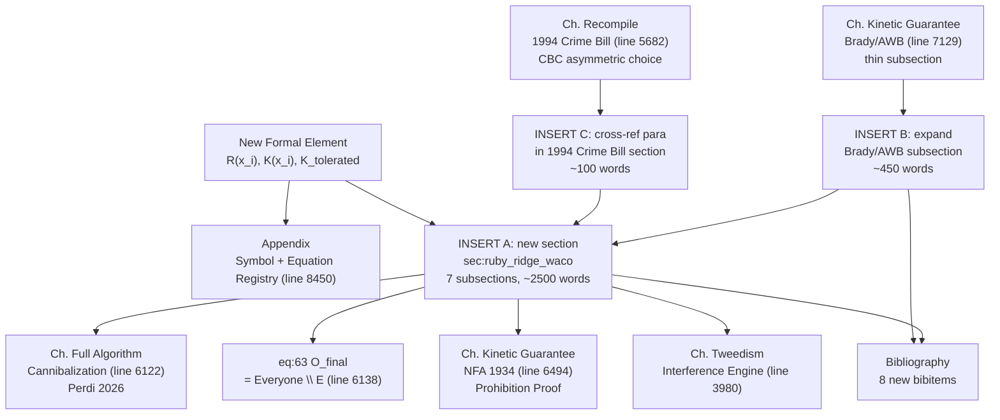

# Ruby Ridge / Waco Cannibalization Integration

## Diagnostic: What the Source Adds That the Paper Does Not Yet Have

The paper already argues the cannibalization phase exists and cites the 2026 Alex Perdi ICE killing as "ultimate, devastating proof" (line 6126). It lacks the **1992–94 historical anchor** that proves this is not a 2026 anomaly but a thirty-four-year-old structural pattern. The paper also:

- Mentions the NFA extensively as the 1934 foundation stone (line 6494+) but never shows its use as a live **pretext subroutine against the Buffer Class**
- Lists "Brady/AWB (1993--94)" in the disarmament timeline tcolorbox (line 6325) yet the subsection at line 7129 is only ~7 lines and omits Ruby Ridge / Waco entirely
- Treats the 1994 AWB as a "minor concession" to the CBC (line 5691) but does not read it as the **dual-vector counter-strike** to the cannibalization-signal the source material reconstructs
- References `O_final = Everyone \ E` (eq:63, line 6138) as a static set but never formalizes the **reclassification operator** that moves individuals across the boundary when kinetic capacity crosses a threshold
- Names the Interference Engine (line 3980) as keeping $I_{\text{buffer}}$ and $O_{\text{racialized}}$ out of solidarity, but never supplies its cleanest case: the Patriot/militia movement 1992–95, which awakened to federal tyranny but retreated into race-coded paranoia rather than cross-racial class alliance

The Ruby Ridge / Waco source is a near-perfect fit: it is already written in the paper's variable notation (E, P_uppet, F_enforce, I_buffer, O_racialized, L_E ≫ L_O, Min/Max) and explicitly cites the 1705 contract, the NFA as economic filter, the Second Amendment as conditional privilege, the Haitian theorem, and the carceral-disarmament dual vector. It effectively supplies the missing section between the paper's current §"Cannibalization of the Buffer Class" (line 6122) and §"The Stress Test: The Epstein Network" (line 6221).

## Integration Strategy: One Flagship Section + Two Smaller Inserts + Formal Registration

No new chapter. One new multi-subsection `\section{...}` inserted mid-chapter inside "The Full Algorithm". One expansion of the thin Brady/AWB subsection in the Disarmament Timeline. One short cross-ref paragraph in the 1994 Crime Bill section. One new operator registered in the Equation Registry and Symbol Registry. Bibliography block of ~8 entries.

---

### Insert A (FLAGSHIP) — new section in Ch. "The Full Algorithm"

**Target:** [Paper/Redefining_Racism.tex](Paper/Redefining_Racism.tex), immediately after §"The Cannibalization of the Buffer Class and the Endpoint of the Algorithm" closes at line 6220 (end of the `\caption{The Recursive Expansion of the Extraction Zone ...}` figure), and before §"The Stress Test: The Epstein Network and Elite Immunity" at line 6221.

**Heading:**
```latex
\section{The First Cannibalization Signal: Ruby Ridge, Waco, and the Reclassification of the Buffer Class (1992--1994)}
\label{sec:ruby_ridge_waco}
```

**Rationale for placement:** the current chapter jumps from the Recursive Expansion figure (Phase 4 = Present cannibalization, fig:extraction_zone) to the 2026 Epstein stress test without a historical execution trace of the cannibalization transition. The source material explicitly identifies Ruby Ridge/Waco as "the exact historical juncture where the Buffer Class recognized its own transition from systemic shield to targeted asset" — this is the missing bridge.

**Structure (approx. 7 subsections, ~2,500 words):**

1. **Opening framing paragraph** — restate the Demographic Paradox already established in §"The Collapse: Cannibalizing the In-Group" (line 6089) and §"The Cannibalization of the Buffer Class" (line 6122), then declare Ruby Ridge and Waco as the first empirically anchored **live-action instantiations** of `F_enforce` deployed against the Buffer Class under rewritten Rules of Engagement. Cross-reference eq:63 (`O_final = Everyone \ E`) at line 6138 and the tri-modal enclosure model at line 139. Note that what the paper has called "cannibalization" in metaphor mode (per the footnote at line 6089 distinguishing from `libidinal_extraction.exe`) has in fact executed in kinetic mode since at least 1992.

2. **\subsection{The Pretext Subroutine: NFA Violations as Legal Proxy ($P_{\text{NFA}}$)}** — read Weaver's 1/4-inch sawed-off shotgun charge and the Branch Davidian M31 inert grenade / AR-15 receiver stockpile through the Universal Latent Criminality architecture already developed at line 6099 and the Prohibition Proof NFA analysis at line 6494. Key move: NFA functions identically for 1990s white separatists and 1980s crack-era Black communities — it is the **substance-invariant proxy** the paper predicts at line 6516 (the "substance changes; architecture identical" argument). Embed a two-column side-by-side table mapping Ruby Ridge vs. Waco onto the paper's existing variables (target demographic, legal pretext, trigger mechanism, pretext → kinetic escalation). Cite the ATF informant entrapment of Weaver and the ATF's bypass of non-violent apprehension at Waco as evidence that the NFA pretext is generated endogenously (matches the paper's line 6498 "the crisis was not an exogenous shock" framing).

3. **\subsection{The Reclassification Operator $\mathcal{R}(x_i)$: Shoot-on-Sight ROE as Kernel Proof}** — the "shoot on sight" Ruby Ridge ROE (DOJ 1994 Berman report, OPR reports at line 11 of source) is the **formal exception** to the standard FBI deadly-force policy. Frame this as the state openly rewriting the boundary function of its own constitutional contract. Introduce the new operator (see Formal Registration section below). Read Horiuchi's shot that killed Vicki Weaver through the paper's Christiana proof (line 2608) and Hamburg 1876 analysis (line 6457) — same algorithm, different decade, different demographic target. CS gas assault at Waco (line 22–23 of source) reads as the chemical analogue of the "every terrible implement of the soldier" asymmetric escalation (line 6466).

4. **\subsection{The Epistemic Rupture: Why the Buffer Class Awakens but Misroutes the Kinetic Response}** — televised images of Mount Carmel burning and Vicki Weaver shot unarmed communicated a structural truth: $\psi_s$ (the status wage of whiteness, established in Ch. "The Application" line 1230 and reaffirmed at line 1253) is a conditional retainer, not a permanent immunity. Cite Heidi Beirich (SPLC) and Mark Pitcavage explicitly: Ruby Ridge was "the spark," Waco "allowed the movement to rebrand and broaden its appeal" beyond white supremacism because the Davidians were racially diverse. Connect to the existing Pullman Strike analysis (line 3111) on how the Buffer Class repeatedly refuses to learn the theorem.

5. **\subsection{The Misdirected Kinetic Response: The Interference Engine at Peak Load}** — the Patriot / militia movement (Estes Park Rocky Mountain Rendezvous 1992, Militia of Montana 1994, Michigan Militia, Louis Beam "leaderless resistance") is the cleanest empirical case of the **Interference Engine** (referenced at line 3980 and the Phase-Loading Algebra at line 4114). The awakened Buffer Class, correctly identifying `F_enforce` as an existential threat, fails to ally with `O_racialized`, whose entire history is exactly the trauma the militia is now experiencing. Cite the Oklahoma City bombing (April 19, 1995, Waco anniversary) as the terminal output: McVeigh's kinetic response strikes a federal building (symbolic `F_enforce`) but because the movement is racially insular, the violence hands `E` the ultimate justification to expand the surveillance state. Formalize the $\Phi_{\text{load}}$ calibration for 1992–95 explicitly and add to the Era-Level Interference Calibration Matrix at line 8507.

6. **\subsection{The Dual-Vector Counter-Strike: The 1994 Crime Bill as Optimization Output}** — the Violent Crime Control and Law Enforcement Act executed simultaneously: (vector 1) carceral expansion targeting `O_racialized` (100k cops, $9B prisons, federal death penalty expansion, three-strikes — already analyzed at line 5682) AND (vector 2) the Federal Assault Weapons Ban targeting the kinetic capacity of the awakened Buffer Class. Brady Act as the first bureaucratic-friction layer (NICS database, Nov 1993). The **dual-vector** framing unifies two sections that currently stand apart in the paper (§ 5682 and § 7129). Explicit claim: both vectors served the identical kernel objective `max E(t)` — the carceral vector harvested `O_racialized` into the 13th Amendment loophole while the AWB vector preemptively degraded `I_buffer` kinetic parity before the militia movement could consolidate. The bill's bundling is not coincidence but **optimization**. Cross-reference the Tweedism asymmetric choice paradigm (line 5687).

7. **\subsection{Updated Formalism: The Reclassification Operator and the Conditional 1705 Contract}** — present the reclassification operator in full formalism (see "New Formal Element" section below). State the key theorem: the 1705 contract's status-wage guarantee is conditional on `K_B ≤ K_tolerated` where `K_B` is the Buffer Class's kinetic capacity and `K_tolerated` is `E`'s tolerance threshold. When `K_B > K_tolerated`, the system executes `R(x_i): I_buffer → O_final`, stripping `psi_s` protections. Close with one-paragraph diagnostic: Ruby Ridge proved the operator exists in 1992, the Perdi case (line 6126) proved it still executes in 2026, and the thirty-four-year gap is not contradiction but confirmation that the operator is a **permanent kernel feature**, not an anomaly.

**Figures/tables in Insert A:**
- one two-column `\begin{table}` comparing Ruby Ridge vs. Waco across five rows (target demographic, legal pretext, trigger mechanism, ROE/tactical escalation, accountability output), using the existing manuscript table style
- one optional `tikzpicture` state-transition diagram showing `I_buffer → [K_B > K_tolerated] → O_final` with $\mathcal{R}$ on the edge (reuse the visual language of fig:extraction_zone at line 6141)

---

### Insert B — expansion of §"The Brady Act (1993) and the Federal Assault Weapons Ban (1994--2004)"

**Target:** [Paper/Redefining_Racism.tex](Paper/Redefining_Racism.tex) §`\subsection{The Brady Act (1993) and the Federal Assault Weapons Ban (1994--2004)}` at line 7129, which is currently ~7 short paragraphs (lines 7129–7136).

**Add before the existing content:** two paragraphs, approximately 400–500 words:

- **Contextual paragraph:** the AWB did not appear in a political vacuum; it was drafted and passed in the immediate aftermath of the Ruby Ridge (Aug 1992) and Waco (Apr 1993) sieges, the 101 California Street shooting (Jul 1993), and the visible emergence of the Patriot/militia movement. The hardware specifically enumerated in the AWB — semi-automatic rifles with detachable magazines, magazines exceeding ten rounds, barrel shrouds, pistol grips — directly tracks the inventory the ATF catalogued at Mount Carmel (136 firearms, 200,000 rounds, AR-15 lower receivers, 700+ magazines per Treasury 1993 report). The ban's targeting is not abstract; it is a **retrospective inventory disarmament** of the exact hardware the Branch Davidian stockpile embodied.
- **Algorithmic reading:** cross-reference §\ref{sec:ruby_ridge_waco} (Insert A). Frame the AWB as the Buffer-Class-facing half of the 1994 Crime Bill's dual-vector optimization. This closes the loop with the already-existing §"The 1994 Crime Bill and the Tweedism Trap" at line 5682, which currently describes the AWB only as a CBC concession — the Insert A framing shows the AWB was simultaneously a concession AND a preemptive disarmament of `I_buffer`, and that the two functions are not in tension but are **co-optimal** under `max E(t)`.

**Preserve:** the existing line 7133 analysis of cosmetic-feature targeting, the ten-year sunset, the Koper (2004) null-result citation, and the state-level P_spatial continuation. These remain correct; the insert supplies the missing historical-causative context.

---

### Insert C — small cross-reference paragraph in §"The 1994 Crime Bill and the Tweedism Trap"

**Target:** [Paper/Redefining_Racism.tex](Paper/Redefining_Racism.tex) line 5691, end of paragraph discussing the CBC's "minor concessions (the Violence Against Women Act; the Assault Weapons Ban)".

**Add:** one short paragraph (~80–120 words) noting that the AWB was not *merely* a concession traded for CBC votes; it simultaneously served a second optimization vector against the post-Ruby Ridge / post-Waco militia movement. The asymmetric choice paradigm documented in the CBC vote is the `O_racialized`-facing interface of the same statute whose `I_buffer`-facing interface is analyzed in §\ref{sec:ruby_ridge_waco}. One statute, two vectors, one kernel objective.

---

### New Formal Element — The Reclassification Operator $\mathcal{R}(x_i)$

**Motivation:** the paper's current `O_final = Everyone \ E` (eq:63, line 6138) is a **static set-theoretic statement**. It does not express the dynamic mechanism by which individuals cross the boundary. The Ruby Ridge ROE (shoot-on-sight for "any adult male observed with a weapon") is a literal instantiation of a reclassification operator: at t_0, Weaver is a member of $I_{\text{buffer}}$ with full constitutional rights; at t_1, the system has executed $\mathcal{R}$ and he is a member of $O_{\text{final}}$ with no due process. The operator is what makes eq:63 dynamic rather than static.

**Formal definition (to be placed inside Insert A subsection 7 and registered in the Appendix):**

Let `K(x_i)` denote the kinetic capacity of individual `x_i` (armament plus demonstrated willingness to deploy against `F_enforce`). Let `K_tolerated` denote `E`'s threshold for permitted Buffer-Class kinetic capacity (historically calibrated: high pre-1992, low post-2022). The reclassification operator acts as:

```
    R(x_i) = { x_i ∈ I_buffer   if  K(x_i) ≤ K_tolerated AND compliance(x_i) = 1
             { x_i ∈ O_final    if  K(x_i) >  K_tolerated OR  compliance(x_i) = 0
```

The operator's fixed points are `E` (always in, never reclassified) and the incarcerated subset of `O_racialized` (always out, already reclassified). All other citizens are **conditional** — their classification is re-evaluated continuously, and the trigger is not race but the intersection of kinetic capacity and compliance.

**Registration changes (Appendix):**

- [Paper/Redefining_Racism.tex](Paper/Redefining_Racism.tex) §`Canonical Symbol Registry` (line 8479) — add three new rows to the `longtable`:
  - `K(x_i)` — kinetic capacity of individual `x_i` (armament × willingness-to-deploy)
  - `K_tolerated` — E's threshold for permitted Buffer-Class kinetic capacity
  - `R(x_i)` — reclassification operator (conditional assignment of `x_i` to `I_buffer` or `O_final`)
- [Paper/Redefining_Racism.tex](Paper/Redefining_Racism.tex) §`Era-Level Interference Calibration Matrix` (line 8507) — add one new row: `1992--1995 (Ruby Ridge / Waco / OKC)` with `Phi_load ∈ [0.70, 0.85]`, `rho_tau ∈ [0.72, 0.88]`, Tier 1 confidence, evidence pathway: DOJ Berman inquiry 1994, OPR 2001, Danforth 2000, SPLC 1994–2025 archival.
- [Paper/Redefining_Racism.tex](Paper/Redefining_Racism.tex) §`Canonical Equation: The Predatory Min-Max Function` (line 8453) — add one new definition block after the `Concession Invariant`: `Boundary dynamics: R(x_i) executes whenever K(x_i) > K_tolerated, moving x_i from I_buffer to O_final with psi_s(x_i) → 0`.

---

### Bibliography Additions

Add to the bibliography block starting at line 8653 in [Paper/Redefining_Racism.tex](Paper/Redefining_Racism.tex) (~100 existing `\bibitem` entries). New `\bibitem` keys and minimal bib data:

- `\bibitem{dojruby1994}` — Berman Report / DOJ OPR Ruby Ridge Task Force Report (1994). Cited in Insert A subsections 3 and 7.
- `\bibitem{oprruby2001}` — DOJ Office of Professional Responsibility, Ruby Ridge disciplinary final report, January 2001. Cited in Insert A subsection 3.
- `\bibitem{danforth2000}` — Special Counsel John C. Danforth, Final Report to the Deputy Attorney General Concerning the 1993 Confrontation at the Mt. Carmel Complex, Waco, Texas (2000). Cited in Insert A subsection 3.
- `\bibitem{treasury1993waco}` — U.S. Department of the Treasury, Report of the Department of the Treasury on the Bureau of Alcohol, Tobacco, and Firearms Investigation of Vernon Wayne Howell, Also Known as David Koresh (Sept. 1993). Cited in Insert A subsection 2 and Insert B.
- `\bibitem{splc_patriot_timeline}` — Southern Poverty Law Center, "The 'Patriot' Movement Timeline" (1992–present). Cited in Insert A subsections 4 and 5.
- `\bibitem{pitcavage2001}` — Mark Pitcavage, "Camouflage and Conspiracy: The Militia Movement from Ruby Ridge to Y2K," *American Behavioral Scientist* 44(6), 2001. Cited in Insert A subsection 4.
- `\bibitem{markham_willamette}` — Cameron Markham, "Firearm Stockpiling as a Symptom of the White Patriot Identity," *Willamette Law Journal* 2(2). Cited in Insert A subsection 5.
- `\bibitem{wright_mcveigh}` — Stuart Wright, *Patriots, Politics, and the Oklahoma City Bombing* (Cambridge UP, 2007). Cited in Insert A subsection 5 on the McVeigh connection.

No source in the new content is Wikipedia; the source's Wikipedia citations (Ruby Ridge Wikipedia, Waco Wikipedia) are replaced by the underlying primary documents (Berman, OPR, Danforth, Treasury) that those Wikipedia articles themselves cite.

---

### Cross-References and Internal Plumbing

- Add `\label{sec:ruby_ridge_waco}` to the Insert A section heading.
- In the existing eq:63 paragraph (line 6135–6139), add one trailing sentence: "The dynamic mechanism by which citizens cross this boundary — the reclassification operator $\mathcal{R}(x_i)$ — is formalized in §\ref{sec:ruby_ridge_waco} and registered in the Equation Registry (Appendix~\ref{sec:equation_registry})."
- In the tcolorbox runtime log for Ch. "The Kinetic Guarantee" (line 6325), replace the terse "Brady/AWB (1993--94)" bullet with a cross-reference to §\ref{sec:ruby_ridge_waco} for context.
- In the Perdi paragraph (line 6126), add a parenthetical: "(the reclassification operator $\mathcal{R}$ is not a 2026 innovation; its 1992--94 execution is documented at §\ref{sec:ruby_ridge_waco})".
- In §"The 1994 Crime Bill and the Tweedism Trap" (line 5691) Insert C paragraph, cross-ref §\ref{sec:ruby_ridge_waco}.
- In §"The Brady Act (1993) and the Federal Assault Weapons Ban (1994--2004)" (line 7129) Insert B, cross-ref §\ref{sec:ruby_ridge_waco}.
- In §"The Interference Engine: How Identity Debates Cancel Class Solidarity" (line 3980), add one sentence naming the Patriot/militia movement 1992–95 as a case study, cross-ref §\ref{sec:ruby_ridge_waco}.

---

### Integration Flow (mermaid diagram of how the new material threads through the existing paper)



---

### Proportionality Check

- New prose: ~3,100 words (Insert A ~2,500 + Insert B ~450 + Insert C ~120 + operator registration text).
- Paper is 9,663 lines. New content is ~3.2% growth — larger than the Woodard integration (<2.5%) but proportional to the analytic weight: this content unifies three existing chapters (Full Algorithm, Recompile, Kinetic Guarantee) and supplies the dynamic mechanism behind eq:63.
- New bibliography: 8 entries (100 → 108).
- New labels: 1 (`sec:ruby_ridge_waco`).
- New formal elements: 1 operator `R(x_i)` + 2 supporting variables (`K(x_i)`, `K_tolerated`).
- No change to chapter count, part structure, canonical equation eq:94, or the 5-tier hierarchy. All new material reuses existing variables except the three registered additions.

### Out of Scope for This Pass

- **Visual / figure expansion:** only one `\begin{table}` (Ruby Ridge vs. Waco comparison) is included in Insert A. An additional state-transition tikzpicture is mentioned as optional. Full figure treatment of ROE / CS gas timelines is deferred.
- **Oklahoma City analytic deepening:** the source treats McVeigh/OKC as ~1 paragraph of misdirected kinetic response; Insert A preserves this proportion. A fuller OKC analysis is naturally a follow-on pass in the Interference Engine or Patriot Timeline appendix.
- **International parallels** (e.g., Jean-Bertrand Aristide, Yugoslav disarmament-then-war) that would test the reclassification operator cross-jurisdictionally are deferred to the Global Containment Field chapter (line 7836).
- **NFA $0 tax paradox integration:** the paper already covers this at line 7075. Insert A cross-references it but does not expand.
- **OpenDyslexic variant file** ([Paper/Redefining_Racism_OpenDyslexic.tex](Paper/Redefining_Racism_OpenDyslexic.tex)) is not modified in this pass; it can be resynced via the existing `assemble_restructure.sh` workflow after the main file is stable.

### Session Log Note

Per user rule, a session log at `__Avenue/harper/logs/session-YYYY-MM-DD-HHMMSS.md` will be created as the first action of the implementation phase (plan mode forbids non-markdown writes). Log will document: what was requested (Ruby Ridge/Waco integration), inserts A/B/C executed, operator registration completed, bibliography entries added, latexmk/pdflatex build verification, any challenges encountered.
