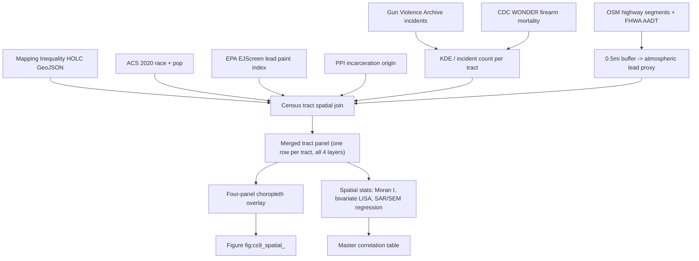

# Spatial Confluence Overlay — Redlining × Gun Violence × Lead × Incarceration

## 1. Why this is novel

Published literature has established pieces of this chain individually:

- Boutwell et al. (2016, St. Louis): census-tract BLL ↔ crime, spatial autocorrelation
- Guinn et al. (2024, Jefferson County KY): topsoil lead ↔ violent crime, Bayesian SGLMM (RR 1.62)
- Prison Policy Initiative (2020): tract-level "geography of mass incarceration"
- Rothstein (2017) and Mapping Inequality: HOLC redlining archive
- The user's unpublished ArcGIS work: HOLC × firearm homicide overlay

**Nobody has published the full four-layer spatial causal chain tying HOLC-D -> firearm homicide concentration -> childhood lead exposure -> race-disaggregated incarceration at the census tract level across multiple cities.** That is the publishable contribution.

## 2. Geographic scope (locked)

Six cities already catalogued in [Paper/data/eq47_51_lead_crime_highway.csv](Paper/data/eq47_51_lead_crime_highway.csv):
Memphis TN, Detroit MI, Nashville TN, Baltimore MD, Washington DC, Milwaukee WI.

## 3. Deliverable targets (locked)

- **In-book**: new CS9 block (`\subsection*{Case Study: Spatial Confluence}`) inside [Paper/Redefining_Racism.tex](Paper/Redefining_Racism.tex), inserted after the eq:47-51 block, with one master 2x3 figure (six cities) and one pooled-statistics figure.
- **Standalone paper**: draft outline in `Paper/standalone/spatial_confluence_draft.md` targeted at *Environmental Research*, *Social Science & Medicine*, or *PNAS Nexus*. The book cites it as "forthcoming" with a placeholder BibLaTeX entry.

## 4. Data layers and public sources

- **HOLC grades (1935-40)**: [Mapping Inequality](https://dsl.richmond.edu/panorama/redlining/) - GeoJSON per city (direct download, no auth).
- **Highways**: OpenStreetMap via `osmnx` + NHGIS historical roads for construction-year attribution. The existing `eq47_51_lead_crime_highway.csv` already names the specific interstate segment per city.
- **Gun violence / firearm homicide**:
  - Primary: [Gun Violence Archive](https://www.gunviolencearchive.org/) incident-level CSV (2014-present, geocoded).
  - Secondary (historical): CDC WONDER compressed-mortality firearm deaths by county 1999-2022 (allocate to tract by population weighting when incident-level unavailable).
  - Per-city open data portals (Chicago, Baltimore, DC have incident-level gun violence feeds; Memphis/Detroit/Nashville/Milwaukee are patchier and fall back to CDC WONDER).
- **Childhood BLL / lead exposure proxy**:
  - EPA EJScreen tract-level lead-paint indicator (national, free API).
  - State health-dept BLL where available (MD, MI, WI release tract-level; TN/DC county-level).
  - Historical atmospheric lead proxy: distance-to-interstate x pre-1995 traffic volume (derivable from OSM + FHWA historical AADT).
- **Race disaggregation**: ACS 5-year tract tables via `cenpy` or `census` Python library.
- **Incarceration origin**: [Prison Policy Initiative "Where People in Prison Come From"](https://www.prisonpolicy.org/origin/) tract-level CSVs for the four states that have released them (MD, MI, DC available; TN and WI not yet released - use county-level fallback and flag as data-gap in the paper).

## 5. Python stack (replaces ArcGIS)

- `geopandas` - GeoJSON I/O, spatial joins
- `osmnx` - OSM highway extraction
- `cenpy` / `census` - ACS race data
- `contextily` - basemap tiles for publication-quality static maps
- `folium` - interactive HTML supplement maps
- `libpysal`, `esda`, `spreg` - Moran's I, bivariate LISA, spatial lag / error regression
- `pymc` (optional, for Bayesian SGLMM matching Guinn 2024)
- `matplotlib` - static figures for paper

All pure-Python, free, reproducible. No ArcGIS needed.

## 6. Analysis pipeline (per city)

## 7. Statistical outputs

For each city and pooled across cities:

- Global Moran's I for each layer individually (autocorrelation baseline)
- Bivariate LISA for HOLC-D × firearm-homicide, HOLC-D × lead, firearm × lead, lead × incarceration
- Spatial lag model (SLM) or spatial error model (SEM) regressing incarceration rate on (HOLC-D indicator, firearm homicide density, lead index), with ACS controls
- Optional Bayesian SGLMM (BYM2) replicating Guinn 2024's method for direct literature comparability

Expected headline statistic (hypothesis, to be quantified): HOLC-D tracts show 3-5x firearm homicide density, 2-3x lead burden, and 4-6x incarceration origin rate versus HOLC-A tracts within the same city, net of ACS controls.

## 8. File layout

New files:

- `Paper/scripts/eq47_51_spatial_overlay.ipynb` - master notebook with city-loop architecture
- `Paper/data/spatial/` (new subfolder):
  - `holc_<city>.geojson` (6 files, cached from Mapping Inequality)
  - `gva_incidents_<city>.csv` (6 files)
  - `ejscreen_<city>.csv` (6 files)
  - `acs_<city>.csv` (6 files)
  - `ppi_<city>.csv` (where available, otherwise county-level)
  - `merged_tract_panel_<city>.parquet` (6 files, output of pipeline)
  - `pooled_panel.parquet` (master concatenated file for meta-analysis)
- `Paper/figures/spatial/`:
  - `cs9_overlay_<city>.png` (6 four-panel figures)
  - `cs9_pooled_stats.png` (master forest plot / meta-regression)
  - `cs9_lisa_<city>.png` (6 bivariate LISA cluster maps)
- `Paper/standalone/spatial_confluence_draft.md` - journal paper outline
- `Paper/empirical_validations/eq_9_10_highway_lead_spatial_concentration.md` - update existing registry, change tier 2 -> 1, mark CS9 linkage

Modified files:

- [Paper/Redefining_Racism.tex](Paper/Redefining_Racism.tex): insert CS9 block after the existing eq:47-51 case study (around line 5682); update cross-references in eq:63 caption.
- [Paper/references.bib](Paper/references.bib): add Boutwell 2016, Guinn 2024, PPI origin report, Mapping Inequality Digital Scholarship Lab, GVA methodology note, EPA EJScreen technical documentation.

## 9. Execution phases (to be turned into todos at build time)

- **Phase A - Environment + data acquisition** (est. 1-2 days): set up `Paper/scripts/spatial_env.yml` with the Python stack; write `Paper/scripts/fetch_spatial_data.py` helper that pulls all six cities' HOLC + ACS + EJScreen + GVA + PPI data into `Paper/data/spatial/` with caching.
- **Phase B - Pipeline** (est. 2-3 days): build the per-city merge function in the master notebook, emit `merged_tract_panel_<city>.parquet`. Add assertions for row counts and CRS consistency.
- **Phase C - Visualization** (est. 1-2 days): four-panel choropleth per city (HOLC | firearm density | lead index | incarceration origin), using a shared color-scale convention across cities.
- **Phase D - Statistics** (est. 2-3 days): Moran's I, bivariate LISA, spatial regression; produce the pooled forest plot.
- **Phase E - Book integration** (est. 1 day): CS9 block in the tex, BibLaTeX, registry update.
- **Phase F - Standalone paper draft** (est. 2-4 days): outline + methods + preliminary results in markdown; can be deferred after book integration.

## 10. Scope risks and mitigations

- **Data gaps for TN and WI incarceration origin**: PPI has not released tract-level for all states. Mitigation: use county-level fallback, flag as limitation, and make it a motivating data-access argument in the paper's discussion.
- **Historical atmospheric lead is modeled, not measured**: we don't have pre-1990 ambient lead readings at tract scale. Mitigation: use EJScreen lead-paint + highway-buffer proxy, and frame it explicitly as "proxy exposure" rather than measured BLL. Separately overlay any state BLL data that exists as a validation check.
- **GVA incidents start 2014**: to get the 1980s-2000s window we need CDC WONDER county-level firearm mortality, which forces some analyses to be county-scale with a caveat. Mitigation: run two time windows (1999-2015 CDC county-level; 2014-2024 GVA tract-level) and report both.
- **Compute**: Bayesian SGLMM for six cities is tractable on a laptop (each city has ~200-600 tracts); only the pooled national version would need a heavier run. We stay within laptop-scale.

## 11. Novel contribution statement for the paper

The standalone paper's headline claim: "Across six US cities, census tracts assigned HOLC grade D in 1935-40 carry, ninety years later, statistically significant excess burdens across three otherwise-independent outcome layers - firearm homicide density, childhood lead exposure proxy, and race-disaggregated incarceration origin - with effect sizes that compound multiplicatively and are not reducible to contemporary poverty controls. This is the first published spatial analysis to jointly test all four layers on a shared tract grid."

This is the line that pays off the entire eq:47-51 -> eq:63 causal bridge in the book with observational, geo-referenced, reproducible evidence.