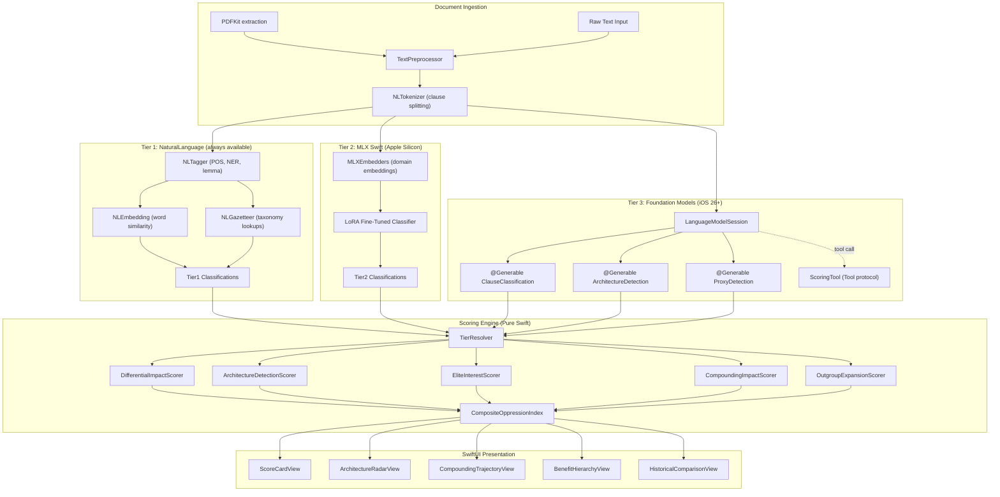

# Swift iOS Oppression Algorithm -- Policy Scoring Engine

## Current State

- **Paper**: [Redefining_Racism.tex](Redefining_Racism.tex) -- defines E/I\E/O groups, Predatory Min-Max Function, compounding model, 4 architectural components
- **Apple AI/ML docs**: NaturalLanguage (NLTokenizer, NLTagger, NLEmbedding), Foundation Models (@Generable, Tool, LanguageModelSession), CreateML (MLTextClassifier)
- **Swift Testing**: [swiftDocs/Testing/swift-testing-repo/](swiftDocs/Testing/swift-testing-repo/) available for test patterns
- **No iOS app exists yet** -- building from scratch

## Why Swift + Three-Tier ML is a Strong Fit

The Python plan used keyword matching + FastAPI. The Swift version replaces every component with native equivalents and adds a custom fine-tuned model:

- **PyMuPDF** --> **PDFKit** (native, no dependencies)
- **NLTK/spaCy keyword engine** --> **NLTokenizer + NLTagger + NLEmbedding** (baseline NLP)
- **Hardcoded keyword dictionaries** --> **MLXEmbedders** for domain-aware semantic embeddings that understand policy language far better than generic word embeddings
- **Manual clause classification** --> **MLX Swift LoRA fine-tuned model** trained specifically on the paper's framework -- a custom "oppression clause classifier"
- **LLM API calls** --> **Foundation Models @Generable** structs for structured AI-powered analysis (iOS 26+)
- **FastAPI server** --> **Not needed** (everything runs on-device)
- **React + D3.js** --> **SwiftUI + Swift Charts**

### Three-Tier ML Architecture

The app uses three ML layers, each progressively more capable. Higher tiers fall back to lower ones when unavailable:

```
Tier 3: Foundation Models (@Generable structured output)   -- iOS 26+ with Apple Intelligence
Tier 2: MLX Swift (fine-tuned clause classifier + embeddings)  -- Apple Silicon (M1+/A17+)
Tier 1: NaturalLanguage (NLTagger + NLEmbedding + NLGazetteer) -- iOS 18+ (always available)
```

Each tier enhances accuracy for the same task (clause classification, architecture detection, proxy detection). The scoring engine consumes classifications regardless of which tier produced them.

## Architecture




### TierResolver Logic

The `TierResolver` merges results from available tiers using a confidence-weighted strategy: if Tier 3 (Foundation Models) is available and its confidence > 0.7, use its classification. Otherwise fall back to Tier 2 (MLX fine-tuned model). If MLX is also unavailable, use Tier 1 (NaturalLanguage keyword matching). Multiple tiers can run in parallel, with the highest-confidence result winning.

## Project Structure

```
OppressionAlgo/
  OppressionAlgo.xcodeproj
  OppressionAlgo/
    App/
      OppressionAlgoApp.swift
      ContentView.swift
    Models/
      Policy.swift                    # Policy, Clause, Section types
      ScoreResult.swift               # All score result types
      HistoricalPolicy.swift          # 4 ground-truth policies
      GenerableTypes.swift            # @Generable structs for Foundation Models
    Scoring/
      PolicyScorer.swift              # Orchestrator: COI = 0.25*DIS + 0.25*ADS + 0.20*EIS + 0.15*CIS + 0.15*OES
      DifferentialImpactScorer.swift  # |O cap P| vs |I\E cap P| vs |E cap P|
      ArchitectureDetector.swift      # 4 components: AAR(0.35), SE(0.20), IJ(0.20), RSC(0.25)
      EliteInterestScorer.swift       # EIS = 0.4*extraction + 0.3*resistance + 0.3*division
      CompoundingCalculator.swift     # O_t = O_{t-1} * (1 - alpha * P_t)
      OutgroupAnalyzer.swift          # Expansion/contraction + proxy detection
    NLP/
      PDFExtractor.swift              # PDFKit text extraction
      TextPreprocessor.swift          # Section/clause splitting
      KeywordEngine.swift             # NLTagger + NLEmbedding + NLGazetteer taxonomy matching
      ClauseAnalyzer.swift            # Per-clause NLP pipeline coordinator
    MLX/
      MLXClauseClassifier.swift       # Fine-tuned model inference via MLXLLM + LoRA adapters
      MLXEmbeddingEngine.swift        # MLXEmbedders: domain-aware semantic embeddings
      LoRATrainer.swift               # On-device LoRA fine-tuning pipeline
      ModelManager.swift              # Download base model from HF, apply LoRA adapters
    AI/
      PolicyAnalysisSession.swift     # Foundation Models LanguageModelSession wrapper
      ScoringTool.swift               # Tool protocol: LLM calls back into scoring engine
      TierResolver.swift              # Merges Tier 1/2/3 classifications by confidence
    Data/
      KeywordTaxonomies.swift         # Static taxonomy dictionaries (O/I\E/E keywords)
      KeywordTaxonomies.json          # Bundled JSON taxonomy data
      TrainingData/
        historical_clauses.jsonl      # Labeled clause training data for LoRA
        validation_clauses.jsonl      # Held-out validation set
    Validation/
      HistoricalPolicies.swift        # 4 ground-truth policies with expected COI
      Validator.swift                 # Regression runner: asserts +/-0.10
    Views/
      PolicyAnalyzerView.swift        # Main container: PDF upload + results
      ScoreCardView.swift             # COI gauge + sub-score bars
      ArchitectureRadarView.swift     # Spider chart (4 components) via Swift Charts / Canvas
      CompoundingTrajectoryView.swift # Line chart: capacity over time
      BenefitHierarchyView.swift      # Stacked bar: E vs I\E vs O
      HistoricalComparisonView.swift  # Overlay against 4 baselines
      PDFPickerView.swift             # Document picker for PDF import
    Styles/
      ScoreCardViewStyle.swift        # MVVM-S style extraction
      ArchitectureRadarViewStyle.swift
      CompoundingTrajectoryViewStyle.swift
      BenefitHierarchyViewStyle.swift
      HistoricalComparisonViewStyle.swift
  Tests/
    ScoringTests/
      DifferentialImpactTests.swift
      ArchitectureDetectorTests.swift
      EliteInterestTests.swift
      CompoundingCalculatorTests.swift
      OutgroupAnalyzerTests.swift
      PolicyScorerTests.swift
    ValidationTests/
      HistoricalPolicyValidationTests.swift  # All 4 policies within +/-0.10
    NLPTests/
      KeywordEngineTests.swift
      TextPreprocessorTests.swift
    MLXTests/
      MLXClauseClassifierTests.swift
      MLXEmbeddingEngineTests.swift
      TierResolverTests.swift
```

## Phase 1 -- Swift Models and Data Types

**Core data models** (`Models/`):

`Policy.swift`:

```swift
struct Policy: Identifiable {
    let id: UUID
    let name: String
    let year: Int
    let sections: [Section]
    var clauses: [Clause]
}

struct Clause: Identifiable {
    let id: UUID
    let text: String
    let sectionType: SectionType
    var targetGroup: TargetGroup?
    var effectDirection: EffectDirection?
}

enum SectionType: String, CaseIterable {
    case title, definitions, operativeClauses, penalties, exceptions
}

enum TargetGroup { case outgroup, ingroupNonElite, elite }
enum EffectDirection { case burden, benefit, neutral }
```

`ScoreResult.swift` -- holds DIS, ADS, EIS, CIS, OES, and final COI (all `Double`, range -1.0 to 1.0)

**@Generable types** (`Models/GenerableTypes.swift`) for Foundation Models structured output. These use constrained decoding -- the model is prevented from generating tokens that violate the schema, so output is guaranteed to match the type:

```swift
@Generable(description: "Classification of a single legislative clause")
struct ClauseClassification {
    @Guide(description: "The group this clause primarily targets")
    var targetGroup: TargetGroup

    @Guide(description: "Whether this clause imposes burden or grants benefit")
    var effectDirection: EffectDirection

    @Guide(description: "Confidence 0-1", .range(0.0...1.0))
    var confidence: Double

    @Guide(description: "Brief rationale for classification")
    var rationale: String

    @Generable
    enum TargetGroup {
        case outgroup
        case ingroupNonElite
        case elite
        case multiple
    }

    @Generable
    enum EffectDirection {
        case burden
        case benefit
        case neutral
        case mixed
    }
}

@Generable(description: "Scores for four architectural components of oppression")
struct ArchitectureDetection {
    @Guide(description: "Restrictions on out-group vs freedoms for in-group", .range(0.0...1.0))
    var asymmetricAutonomyRestriction: Double

    @Guide(description: "Protective language for in-group vs punitive for out-group", .range(0.0...1.0))
    var selectiveEmpathy: Double

    @Guide(description: "Naturalizing or deficit-framing language", .range(0.0...1.0))
    var ideologicalJustification: Double

    @Guide(description: "Provisions suppressing systemic analysis", .range(0.0...1.0))
    var resistanceToStructuralCritique: Double
}

@Generable(description: "Detection of proxy variables and coded language")
struct ProxyDetection {
    @Guide(description: "Whether this clause uses proxy variables for race")
    var usesProxyVariables: Bool

    @Guide(description: "Identified proxy terms", .count(0...5))
    var proxyTerms: [String]

    @Guide(description: "Whether this expands the out-group to new populations")
    var expandsOutgroup: Bool
}
```

Properties are generated **in declaration order** -- put classification fields first so downstream properties can be influenced by earlier ones. The `@Generable` enums use constrained decoding to guarantee the model only picks valid cases.

## Phase 2 -- NLP Pipeline (NaturalLanguage Framework)

**PDFExtractor** (`NLP/PDFExtractor.swift`):

- Uses `PDFKit.PDFDocument` to load PDF, iterates `page.string` preserving structure
- No third-party dependencies needed

**TextPreprocessor** (`NLP/TextPreprocessor.swift`):

- Uses `NLTokenizer(unit: .sentence)` to segment text into sentences
- Heuristic section detection via regex patterns for "SECTION", "TITLE", "DEFINITIONS", etc.
- Groups sentences into `Clause` objects

**KeywordEngine** (`NLP/KeywordEngine.swift`):

- Loads `KeywordTaxonomies.json` containing three keyword dictionaries: O-targeting (burden), I\E-targeting (benefit), E-targeting (extraction)
- Uses `NLTagger(tagSchemes: [.lemma, .nameType, .lexicalClass])` for lemmatization and NER on each clause
- Uses `NLEmbedding.wordEmbedding(for: .english)` for **semantic similarity** matching -- instead of exact keyword matching, computes `NLEmbedding.distance(between: clauseWord, and: taxonomyWord)` to catch synonyms, paraphrases, and coded language
- Uses `NLGazetteer` for exact-match lookups of known proxy terms ("dog whistle" dictionary)
- Returns per-clause feature vectors: keyword match counts by group and effect direction

**ClauseAnalyzer** (`NLP/ClauseAnalyzer.swift`):

- Coordinates the NLP pipeline: tokenize -> tag -> embed -> match
- Produces annotated `Clause` objects with group/effect classifications
- Falls through to Foundation Models session for ambiguous clauses

## Phase 3 -- MLX Swift Integration (Apple Silicon)

### SPM Dependencies

Add to `Package.swift` / Xcode project:

```swift
.package(url: "https://github.com/ml-explore/mlx-swift-lm/", .upToNextMinor(from: "2.29.1"))
```

Libraries used: `MLXLLM` (LLM inference + LoRA), `MLXEmbedders` (text embeddings), `MLXLMCommon` (shared API).

### MLXEmbeddingEngine (`MLX/MLXEmbeddingEngine.swift`)

Uses `MLXEmbedders` to load a domain-aware embedding model from Hugging Face (e.g., `mlx-community/bge-small-en-v1.5`) that produces richer clause embeddings than NLEmbedding's generic word vectors:

```swift
import MLXEmbedders

class MLXEmbeddingEngine {
    private var embedder: EmbedderModel?

    func loadModel() async throws {
        embedder = try await MLXEmbedders.load(id: "mlx-community/bge-small-en-v1.5")
    }

    func embedClause(_ text: String) -> [Float] {
        guard let embedder else { return [] }
        return embedder.encode(text)
    }

    func similarity(clause: String, taxonomyTerm: String) -> Double {
        let v1 = embedClause(clause)
        let v2 = embedClause(taxonomyTerm)
        return cosineSimilarity(v1, v2)
    }
}
```

This produces **384-dimensional vectors** that capture semantic meaning of policy language, enabling the keyword engine to match clauses against taxonomy terms by meaning, not just surface keywords. Catches euphemisms, coded language, and legislative jargon that NLEmbedding's word-level vectors miss.

### LoRA Fine-Tuning Pipeline (`MLX/LoRATrainer.swift`)

Trains a custom "oppression clause classifier" on-device using the paper's framework as ground truth:

**Training data** (`Data/TrainingData/historical_clauses.jsonl`): Labeled clauses from the 4 historical policies, each tagged with:

- `target_group`: outgroup / ingroup_non_elite / elite
- `effect_direction`: burden / benefit / neutral
- `architecture_components`: [AAR, SE, IJ, RSC] scores
- `proxy_variables`: boolean + identified terms

Example JSONL line:

```json
{"text": "No negro shall be permitted to bear arms or weapons of any kind", "target_group": "outgroup", "effect_direction": "burden", "architecture": {"aar": 0.95, "se": 0.1, "ij": 0.3, "rsc": 0.2}}
```

**Fine-tuning workflow** (runs on macOS or iPad with M-series chip):

```swift
import MLXLLM

class LoRATrainer {
    func train() async throws {
        let model = try await loadModel(id: "mlx-community/Qwen3-4B-4bit")

        let trainingData = try loadJSONL(from: "historical_clauses")
        let validationData = try loadJSONL(from: "validation_clauses")

        let config = LoRAConfig(
            rank: 8,
            alpha: 16,
            dropout: 0.05,
            targetModules: ["q_proj", "v_proj"]
        )

        try await model.trainLoRA(
            config: config,
            trainingData: trainingData,
            validationData: validationData,
            epochs: 3,
            batchSize: 4,
            learningRate: 1e-4
        )

        try model.saveLoRAAdapters(to: "policy_classifier_lora")
    }
}
```

**LoRA adapters are tiny** (~~2-8 MB) compared to the base model (~~2 GB). The adapters encode the paper's framework as learned weights, so the model understands concepts like "asymmetric autonomy restriction" and "selective empathy" natively.

### MLXClauseClassifier (`MLX/MLXClauseClassifier.swift`)

Loads the base model + LoRA adapters for inference:

```swift
import MLXLLM
import MLXLMCommon

class MLXClauseClassifier {
    private var session: ChatSession?

    func loadModel() async throws {
        let model = try await loadModel(id: "mlx-community/Qwen3-4B-4bit")
        try model.loadLoRAAdapters(from: "policy_classifier_lora")
        session = ChatSession(model)
    }

    func classifyClause(_ text: String) async throws -> ClauseClassification {
        guard let session else { throw MLXError.modelNotLoaded }
        let response = try await session.respond(to: """
            Classify this legislative clause using the oppression framework.
            Target group (outgroup/ingroup_non_elite/elite):
            Effect (burden/benefit/neutral):
            Confidence (0-1):
            Clause: \(text)
            """)
        return parseClassification(response)
    }
}
```

### ModelManager (`MLX/ModelManager.swift`)

Handles model lifecycle: download base model from Hugging Face on first launch, cache locally, apply LoRA adapters. Shows download progress in UI. The base model (~~2 GB) downloads once; LoRA adapters (~~5 MB) ship bundled with the app.

### Training Data Generation Strategy

1. **Historical policies**: Extract ~200 labeled clauses from the 4 ground-truth policies in the paper
2. **Augmentation**: Use NLTagger + paraphrasing to generate variants of each clause
3. **Modern policies**: Add labeled clauses from contemporary legislation for generalization
4. **Validation split**: 80% train / 20% validation, stratified by target group

## Phase 4 -- Foundation Models Integration (iOS 26+)

### Critical Constraint: 4,096 Token Context Window

The on-device model supports up to **4,096 tokens** per session (~12,000-16,000 English characters). A legislative bill easily exceeds this. Strategy:

- **One session per clause**: Each clause gets its own `LanguageModelSession` for classification. This avoids context overflow and keeps sessions focused.
- **Batch architecture detection**: Group 3-5 short clauses into one session for architecture detection, catching `exceededContextWindowSize` and splitting into smaller batches on failure.
- **Instructions kept short**: ~100 tokens max for instructions, leaving ~3,900 tokens for prompt + response.

### Availability Checking

Must check model availability before any Foundation Models call and provide proper fallback UI:

```swift
private var model = SystemLanguageModel.default

switch model.availability {
case .available:
    // Use Foundation Models pipeline
case .unavailable(.deviceNotEligible):
    // Fall back to NLP-only pipeline, show disclaimer
case .unavailable(.appleIntelligenceNotEnabled):
    // Prompt user to enable Apple Intelligence in Settings
case .unavailable(.modelNotReady):
    // Model downloading -- show progress, use NLP-only meanwhile
case .unavailable:
    // Unknown -- fall back to NLP-only
}
```

### PolicyAnalysisSession (`AI/PolicyAnalysisSession.swift`)

Each clause processed in a **fresh session** to stay within context limits. Instructions kept concise:

```swift
class PolicyAnalysisSession {
    func classifyClause(_ clause: String) async throws -> ClauseClassification {
        let session = LanguageModelSession(instructions: """
            You analyze legislative clauses. Determine which group a clause \
            targets (Out-group, In-group non-Elite, or Elite) and whether it \
            imposes burden or grants benefit.
            """)
        let response = try await session.respond(
            to: clause,
            generating: ClauseClassification.self
        )
        return response.content
    }

    func detectArchitecture(_ clauseTexts: [String]) async throws -> ArchitectureDetection {
        let session = LanguageModelSession(instructions: """
            You detect four architectural components of oppression in policy text: \
            asymmetric autonomy restriction, selective empathy, ideological \
            justification, and resistance to structural critique. Score each 0-1.
            """)
        let combined = clauseTexts.joined(separator: "\n")
        let response = try await session.respond(
            to: combined,
            generating: ArchitectureDetection.self
        )
        return response.content
    }
}
```

### Deterministic Output for Validation

Use greedy sampling during validation tests so results are reproducible across runs (same model version):

```swift
let response = try await session.respond(
    to: clauseText,
    generating: ClauseClassification.self,
    options: GenerationOptions(sampling: .greedy)
)
```

### ScoringTool (`AI/ScoringTool.swift`)

Implements `Tool` protocol so the LLM can call back into the deterministic scoring engine. The model decides when to invoke it based on context:

```swift
struct HistoricalBaselineTool: Tool {
    let name = "getHistoricalBaseline"
    let description = "Get the oppression score of a known historical policy for comparison."

    @Generable
    struct Arguments {
        @Guide(description: "Name of historical policy", .anyOf([
            "Virginia Slave Codes", "13th Amendment", "HOLC Redlining", "War on Drugs"
        ]))
        var policyName: String
    }

    func call(arguments: Arguments) async throws -> String {
        let score = HistoricalPolicies.score(for: arguments.policyName)
        return "Historical COI for \(arguments.policyName): \(score)"
    }
}
```

### Streaming for Progressive UI

Use `streamResponse` so the UI can show partial results as the model generates each `@Generable` property:

```swift
let stream = session.streamResponse(
    to: clauseText,
    generating: ArchitectureDetection.self
)
for try await partial in stream {
    // Update UI as each property (AAR, SE, IJ, RSC) is generated
    await MainActor.run { viewModel.partialArchitecture = partial }
}
```

### Graceful Degradation

If Foundation Models is unavailable (pre-iOS 26, Apple Intelligence off, or model not downloaded), the app falls back to the **deterministic NLP-only pipeline** using NLTagger + NLEmbedding + keyword matching. The Foundation Models layer enhances accuracy for ambiguous clauses but is not required for the core scoring engine to function.

## Phase 5 -- Scoring Engine (Pure Swift Math)

All formulas come directly from the paper (Sections 3-4 of [Redefining_Racism.tex](Redefining_Racism.tex)):

**PolicyScorer** -- orchestrator:

```
COI = 0.25 * DIS + 0.25 * ADS + 0.20 * EIS + 0.15 * CIS + 0.15 * OES
```

**DifferentialImpactScorer**:

- Counts clause classifications per group, computes alignment with oppressive hierarchy: `Benefit(E) >> Benefit(I\E) > Benefit(O)`

**ArchitectureDetector** -- weighted sum of 4 components:

- AAR (0.35): restrictions on O vs freedoms for I
- Selective Empathy (0.20): protective vs punitive language
- Ideological Justification (0.20): naturalizing/deficit language
- Resistance to Structural Critique (0.25): provisions suppressing systemic analysis

**EliteInterestScorer**:

```
EIS = 0.4 * extraction_potential + 0.3 * resistance_suppression + 0.3 * division_maintenance
```

**CompoundingCalculator** -- implements the temporal model from Section 3.1:

```
O_t = O_{t-1} * (1 - alpha * P_t)
```

Computes trajectory against the historical policy chain.

**OutgroupAnalyzer** -- detects O expansion/contraction, proxy variable patterns using NLEmbedding semantic distance for "dog whistle" detection.

## Phase 6 -- Historical Policy Validation

**HistoricalPolicies.swift** -- 4 ground-truth policies with representative clause text from the paper:

- Virginia Slave Codes (1705): expected COI ~0.93
- 13th Amendment (1865): expected COI ~0.35
- HOLC Redlining (1934): expected COI ~0.82
- War on Drugs (1971): expected COI ~0.78

**Validator.swift** -- runs all 4 through PolicyScorer, asserts within +/-0.10.

**HistoricalPolicyValidationTests.swift** -- Swift Testing `@Test` for each policy, using the patterns from [swiftDocs/Testing/](swiftDocs/Testing/):

```swift
@Suite("Historical Policy Validation")
struct HistoricalPolicyValidationTests {
    @Test("Virginia Slave Codes scores ~0.93")
    func virginiaSlaveCodes() async throws {
        let result = try await PolicyScorer().score(HistoricalPolicies.virginiaSlaveCodes)
        #expect(abs(result.compositeIndex - 0.93) <= 0.10)
    }
}
```

## Phase 7 -- SwiftUI Views + Swift Charts + Accessibility

Following the **MVVM-S pattern** (each View gets a corresponding Style file). Every view must meet the accessibility requirements below.

### Accessibility Strategy

This app is data-visualization heavy (charts, gauges, color-coded scores). Without explicit accessibility work, VoiceOver users would get almost nothing from the core output. The accessibility layer is not optional -- it is how the majority of the app's information is conveyed to assistive technology users.

**Environment values to observe in every Style file:**

```swift
@Environment(\.accessibilityReduceMotion) private var reduceMotion
@Environment(\.accessibilityDifferentiateWithoutColor) private var differentiateWithoutColor
@Environment(\.accessibilityReduceTransparency) private var reduceTransparency
@Environment(\.legibilityWeight) private var legibilityWeight
@Environment(\.dynamicTypeSize) private var dynamicTypeSize
```

### Views with Accessibility Requirements

**PolicyAnalyzerView** -- main container with `fileImporter` for PDF selection:

- `.accessibilityLabel("Policy Analyzer")` on the container
- `.accessibilityHint("Upload a PDF of a legislative bill to analyze it for oppressive patterns")` on the upload button
- `.accessibilityIdentifier("policyAnalyzer.uploadButton")` for UI testing
- Use `@AccessibilityFocusState` to move VoiceOver focus to results when analysis completes

**ScoreCardView** -- circular gauge for COI (-1.0 to +1.0) with animated sub-score bars:

- `.accessibilityElement(children: .combine)` to merge gauge + label into one element
- `.accessibilityLabel("Composite Oppression Index")` 
- `.accessibilityValue("0.82, highly oppressive")` -- include both number and plain-English interpretation
- `.accessibilityCustomContent("DIS", "0.91")` for each sub-score
- `.accessibilityCustomContent("Architecture Detection", "0.78")`
- When `differentiateWithoutColor`: add pattern fills or icons alongside color coding (not just red/blue gradient)
- When `reduceMotion`: skip the animated gauge fill, show final state immediately
- `.accessibilityShowsLargeContentViewer()` on the score number for people who long-press

**ArchitectureRadarView** -- custom `Canvas` spider/radar chart of 4 components:

- `Canvas` is **not introspectable by VoiceOver**. Must provide `.accessibilityRepresentation` with a semantic equivalent:

```swift
Canvas { context, size in
    // Draw radar chart...
}
.accessibilityRepresentation {
    VStack {
        ForEach(components) { component in
            Text("\(component.name): \(component.score, format: .percent)")
                .accessibilityAddTraits(.isStaticText)
        }
    }
}
.accessibilityLabel("Architecture Detection Radar Chart")
.accessibilityHeading(.h2)
```

- When `differentiateWithoutColor`: add distinct line patterns (dashed, dotted, solid) for each axis
- `.accessibilityAdjustableAction` to let VoiceOver users swipe up/down through the 4 component scores

**CompoundingTrajectoryView** -- `Chart` with `LineMark`:

- `.accessibilityChartDescriptor(CompoundingChartDescriptor())` implementing `AXChartDescriptorRepresentable`:

```swift
struct CompoundingChartDescriptor: AXChartDescriptorRepresentable {
    func makeChartDescriptor() -> AXChartDescriptor {
        // Define axes: X = time (year), Y = capacity (0-1)
        // Define data series: historical policy chain points
        // VoiceOver reads: "Line chart showing capacity declining from 1.0 in 1619 to 0.12 in 1971"
    }
}
```

- `.accessibilityLabel("Compounding Impact Trajectory")` 
- `.accessibilityHint("Shows how out-group capacity decreases with each historical policy")`

**BenefitHierarchyView** -- `Chart` with `BarMark` stacked by group:

- `.accessibilityChartDescriptor(BenefitChartDescriptor())` for VoiceOver audio graph
- `.accessibilityLabel("Benefit Hierarchy Chart")`
- `.accessibilityValue("Elite receives 73% benefit, In-group non-Elite 20%, Out-group 7%")`
- When `differentiateWithoutColor`: add pattern fills (stripes, dots, crosshatch) to distinguish E / I\E / O bars

**HistoricalComparisonView** -- overlay new policy against 4 baselines:

- `.accessibilityElement(children: .contain)` to let VoiceOver navigate each baseline independently
- Each baseline: `.accessibilityLabel("Virginia Slave Codes, 1705")` + `.accessibilityValue("COI 0.93")`
- The uploaded policy overlay: `.accessibilityAddTraits(.isSelected)` to indicate it's the focus item

### Accessibility in Style Files (MVVM-S)

Each Style file must provide conditional styling based on accessibility preferences. Example pattern:

```swift
struct ScoreCardViewStyle {
    // MARK: - Animations (Reduce Motion aware)
    static func scoreRevealAnimation(reduceMotion: Bool) -> Animation? {
        reduceMotion ? nil : .spring(duration: 0.6)
    }

    // MARK: - Colors (Differentiate Without Color aware)
    static func scoreColor(
        _ score: Double,
        differentiateWithoutColor: Bool
    ) -> (color: Color, icon: String) {
        let color: Color = score > 0.5 ? .red : score < -0.5 ? .blue : .orange
        let icon = differentiateWithoutColor
            ? (score > 0.5 ? "exclamationmark.triangle" : score < -0.5 ? "checkmark.shield" : "minus.circle")
            : ""
        return (color, icon)
    }

    // MARK: - Materials (Reduce Transparency aware)
    static func backgroundMaterial(reduceTransparency: Bool) -> Material {
        reduceTransparency ? .thick : .thin
    }

    // MARK: - Typography (Dynamic Type + Bold Text)
    static func scoreFont(dynamicTypeSize: DynamicTypeSize, legibilityWeight: LegibilityWeight?) -> Font {
        let base: Font = dynamicTypeSize.isAccessibilitySize ? .title : .largeTitle
        return legibilityWeight == .bold ? base.bold() : base
    }
}
```

### Accessible Descriptions -- Per-View Detail

Every view must have descriptions that convey **meaning**, not just structure. A score of "0.82" is meaningless without context. Descriptions should interpret the data.

**ScoreCardView descriptions:**

```swift
.accessibilityLabel("Composite Oppression Index")
.accessibilityValue("\(score, format: .number.precision(.fractionLength(2))), \(interpretScore(score))")
// Reads: "Composite Oppression Index: 0.82, highly oppressive"

.accessibilityHint("Shows the overall oppression score from negative one (liberatory) to positive one (maximally oppressive)")

// Sub-scores as custom content (VoiceOver "More Content" rotor)
.accessibilityCustomContent("Differential Impact", "\(dis, format: .percent)", importance: .high)
.accessibilityCustomContent("Architecture Detection", "\(ads, format: .percent)")
.accessibilityCustomContent("Elite Interest", "\(eis, format: .percent)")
.accessibilityCustomContent("Compounding Impact", "\(cis, format: .percent)")
.accessibilityCustomContent("Out-group Expansion", "\(oes, format: .percent)")
```

**Chart descriptions via `AXChartDescriptorRepresentable`:**

Both `CompoundingTrajectoryView` and `BenefitHierarchyView` use Swift Charts, which supports `accessibilityChartDescriptor`. This enables VoiceOver's **audio graph** feature -- users can hear data as rising/falling tones:

```swift
struct CompoundingChartDescriptor: AXChartDescriptorRepresentable {
    let dataPoints: [CompoundingDataPoint]

    func makeChartDescriptor() -> AXChartDescriptor {
        let xAxis = AXNumericDataAxisDescriptor(
            title: "Year",
            range: 1619...2024,
            gridlinePositions: [1705, 1865, 1934, 1971]
        ) { "Year \(Int($0))" }

        let yAxis = AXNumericDataAxisDescriptor(
            title: "Out-group Capacity",
            range: 0...1.0,
            gridlinePositions: [0, 0.25, 0.5, 0.75, 1.0]
        ) { "\(Int($0 * 100))% capacity" }

        let series = AXDataSeriesDescriptor(
            name: "Capacity over time",
            isContinuous: true,
            dataPoints: dataPoints.map {
                .init(x: Double($0.year), y: $0.capacity,
                      label: "\($0.policyName): \(Int($0.capacity * 100))%")
            }
        )

        return AXChartDescriptor(
            title: "Compounding Impact: Out-group capacity decline",
            summary: "Capacity falls from 100% to \(Int(dataPoints.last!.capacity * 100))% across \(dataPoints.count) policy events",
            xAxis: xAxis, yAxis: yAxis,
            additionalAxes: [],
            series: [series]
        )
    }
}
```

**Heading hierarchy** for rotor navigation:

```swift
// PolicyAnalyzerView
Text("Policy Analysis Results")
    .accessibilityHeading(.h1)

// Each section
Text("Composite Score")
    .accessibilityHeading(.h2)
Text("Architecture Breakdown")
    .accessibilityHeading(.h2)
Text("Compounding Trajectory")
    .accessibilityHeading(.h2)
Text("Benefit Distribution")
    .accessibilityHeading(.h2)
Text("Historical Comparison")
    .accessibilityHeading(.h2)
```

**VoiceOver configuration for score readout:**

```swift
Text(score, format: .number.precision(.fractionLength(2)))
    .speechSpellsOutCharacters(false)
    .speechAdjustedPitch(score > 0.5 ? -0.2 : score < -0.5 ? 0.2 : 0)
    // Lower pitch for oppressive scores, higher for liberatory
```

### Accessible Navigation -- Custom Rotors

VoiceOver rotors let users jump directly to elements. This app defines **three custom rotors** for efficient navigation:

**1. "Scores" rotor** -- jump between the 6 dimension scores:

```swift
PolicyAnalyzerView()
    .accessibilityRotor("Scores") {
        AccessibilityRotorEntry("Composite Index: \(coi)", id: coiID)
        AccessibilityRotorEntry("Differential Impact: \(dis)", id: disID)
        AccessibilityRotorEntry("Architecture Detection: \(ads)", id: adsID)
        AccessibilityRotorEntry("Elite Interest: \(eis)", id: eisID)
        AccessibilityRotorEntry("Compounding Impact: \(cis)", id: cisID)
        AccessibilityRotorEntry("Out-group Expansion: \(oes)", id: oesID)
    }
```

**2. "Historical Policies" rotor** -- jump between baseline comparisons:

```swift
HistoricalComparisonView()
    .accessibilityRotor("Historical Policies", entries: historicalPolicies, entryLabel: \.accessibilityDescription)
```

**3. "Clauses" rotor** -- navigate analyzed clauses by classification:

```swift
ClauseListView()
    .accessibilityRotor("Oppressive Clauses", entries: clauses.filter { $0.score > 0.5 }) { clause in
        AccessibilityRotorEntry(clause.shortDescription, id: clause.id)
    }
    .accessibilityRotor("Liberatory Clauses", entries: clauses.filter { $0.score < -0.5 }) { clause in
        AccessibilityRotorEntry(clause.shortDescription, id: clause.id)
    }
```

**Sort priority** -- ensure VoiceOver reads results in logical order:

```swift
ScoreCardView(result: result)
    .accessibilitySortPriority(5)  // Read first
ArchitectureRadarView(result: result)
    .accessibilitySortPriority(4)  // Read second
CompoundingTrajectoryView(result: result)
    .accessibilitySortPriority(3)
BenefitHierarchyView(result: result)
    .accessibilitySortPriority(2)
HistoricalComparisonView(result: result)
    .accessibilitySortPriority(1)  // Read last
```

**Linked groups** -- connect related elements across the layout:

```swift
// Link each sub-score label to its corresponding chart section
ScoreLabel("Architecture Detection")
    .accessibilityLinkedGroup(id: "architecture", in: namespace)
ArchitectureRadarView()
    .accessibilityLinkedGroup(id: "architecture", in: namespace)
```

### Accessibility Testing Checklist

- VoiceOver: Navigate entire app. Every element must have a label. Charts must read data via audio graphs.
- VoiceOver Rotors: "Scores", "Historical Policies", and "Clauses" rotors all functional.
- VoiceOver Headings: Rotor headings mode navigates h1/h2 hierarchy correctly.
- Dynamic Type: Set to largest accessibility size. No text truncation. Layouts reflow vertically.
- Differentiate Without Color: Turn on in Settings. Score severity must be distinguishable without color.
- Reduce Motion: Turn on. No animations play. Score gauge shows final state immediately.
- Reduce Transparency: Turn on. All blurred backgrounds use opaque fallbacks.
- Switch Control: All interactive elements reachable. PDF upload actionable.
- Voice Control: All buttons have spoken names. "Upload PDF" voice command works.
- Audio Graphs: Long-press on CompoundingTrajectory and BenefitHierarchy charts to hear sonified data.

## Key Advantages Over Python Version

- **Fully on-device**: No server, no API keys, no network dependency -- privacy by default
- **Custom fine-tuned model via MLX LoRA**: A purpose-built "oppression clause classifier" trained on the paper's framework, not a generic LLM prompt
- **Domain-aware embeddings via MLXEmbedders**: Richer semantic matching than generic word vectors, catches legislative jargon and coded language
- **Structured AI output via @Generable**: Type-safe clause classification with constrained decoding -- no JSON parsing, no hallucinated fields
- **Tool calling**: Foundation Models LLM can invoke the deterministic scoring engine mid-analysis
- **Three-tier graceful degradation**: Tier 3 (Foundation Models) -> Tier 2 (MLX fine-tuned) -> Tier 1 (NaturalLanguage keyword matching)
- **On-device training**: Users or researchers can fine-tune the model further with their own labeled policy data

## Verification

1. Run `HistoricalPolicyValidationTests` -- all 4 policies pass within +/-0.10 using each tier independently
2. Run `MLXClauseClassifierTests` -- fine-tuned model correctly classifies held-out validation clauses with > 80% accuracy
3. Run `TierResolverTests` -- verify confidence-weighted merging produces correct fallback behavior
4. Build and run on Simulator (iOS 26+) -- PDF import works, scoring completes, all 5 visualizations render
5. Test three-tier fallback chain:
  - Tier 3 only: Enable Apple Intelligence, verify @Generable structured output
  - Tier 2 only: Disable Apple Intelligence, verify MLX fine-tuned model inference
  - Tier 1 only: Run on non-Apple Silicon simulator, verify NLP-only pipeline produces valid scores
6. Test LoRA training: Run `LoRATrainer` on macOS, verify adapter weights export and reload correctly

