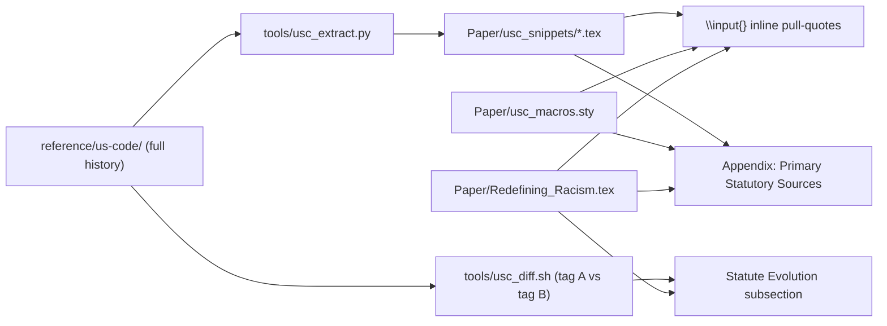

## Goal

Turn the `us-code` clone from a loose reference into an auditable, citeable primary-source layer inside [Paper/Redefining_Racism.tex](Paper/Redefining_Racism.tex), at three depths:

1. Inline blockquotes next to every concrete USC citation already in the paper.
2. A new appendix reproducing the exact statutory text so readers can verify without leaving the PDF.
3. A small "Statute Evolution" subsection showing how key statutes mutated between Congresses, using git tag diffs from the repo.

## Prerequisite: Full clone

The current `reference/us-code/` is a `--depth 1` clone (404 MB, no tags). Re-clone with full history so tag-based diffs work:

- Delete `reference/us-code/`.
- Clone again without `--depth`: `git clone https://github.com/nickvido/us-code.git reference/us-code`.
- Verify with `git -C reference/us-code tag | wc -l` (upstream README lists 15 tags including `annual/2013`, `annual/2025`, `congress/113`...`congress/118`).
- `reference/us-code/` is already in [.gitignore](.gitignore), so no commit risk.

## Citation target map

Mapping of statutes already cited in [Paper/Redefining_Racism.tex](Paper/Redefining_Racism.tex) to files in the repo. These are the integration anchors:

- `18 U.S.C. § 922(g)(3)` at line 4836 and `18 U.S.C. § 922(o)` Hughes Amendment at line 7133 -> [reference/us-code/uscode/title-18-crimes-and-criminal-procedure/chapter-044-firearms.md](reference/us-code/uscode/title-18-crimes-and-criminal-procedure/chapter-044-firearms.md)
- LEOSA (referenced in the Enforcement Class section around line 1870) -> same file (18 USC 926B, 926C)
- `26 U.S.C. ch. 53` National Firearms Act at line 7124 -> `reference/us-code/uscode/title-26-internal-revenue-code/chapter-053-*.md`
- `50 U.S.C. ch. 36` FISA at line 7389 -> `reference/us-code/uscode/title-50-war-and-national-defense/chapter-036-*.md`
- `42 U.S.C. §§ 2000d-2000d-7` Title VI at line 7577 -> [reference/us-code/uscode/title-42-the-public-health-and-welfare/chapter-021-civil-rights.md](reference/us-code/uscode/title-42-the-public-health-and-welfare/chapter-021-civil-rights.md)
- 13th Amendment loophole / enforcement (chapter 5) -> [reference/us-code/uscode/title-18-crimes-and-criminal-procedure/chapter-013-civil-rights.md](reference/us-code/uscode/title-18-crimes-and-criminal-procedure/chapter-013-civil-rights.md) (§§241, 242 - deprivation under color of law, key to the Qualified Immunity argument)
- Redlining / Fair Housing chapter -> [reference/us-code/uscode/title-42-the-public-health-and-welfare/chapter-045-fair-housing.md](reference/us-code/uscode/title-42-the-public-health-and-welfare/chapter-045-fair-housing.md)
- Nineteenth Amendment / Indian Citizenship suffrage discussion (~line 1634) -> [reference/us-code/uscode/title-52-voting-and-elections/chapter-103-enforcement-of-voting-rights.md](reference/us-code/uscode/title-52-voting-and-elections/chapter-103-enforcement-of-voting-rights.md) plus `title-25-indians/`
- "Gang Morphology of the Enforcement Class" (~line 1887) -> `title-18-crimes-and-criminal-procedure/chapter-026-criminal-street-gangs.md` (ironic counter-citation)

## Architecture

## Deliverables

### 1. Tooling (kept out of the paper)

- `tools/usc_extract.py` - reads a chapter `.md` file from `reference/us-code`, selects a section range by anchor id (e.g. `section-922`), strips YAML frontmatter, converts Markdown bold subsection labels (`**(a)**`, `**(1)**`) to LaTeX, and emits a `.tex` snippet under `Paper/usc_snippets/`.
- `tools/usc_diff.sh TAG_A TAG_B TITLE_PATH` - wraps `git -C reference/us-code diff TAG_A..TAG_B -- uscode/<path>` and renders a minimal, paper-ready textual diff (context lines + additions/removals) into a `.tex` file.
- One re-runnable command, e.g. `make usc-snippets`, to regenerate all snippets after a `git pull` in the clone.

### 2. LaTeX macros

New style file `Paper/usc_macros.sty` providing:
- `\uscquote{title}{section}{file}` - standardized blockquote env with a caption "United States Code, Title X section Y (as of <tag>)".
- `\usclink{18}{922(g)(3)}` - inline cite form that also anchors to the appendix entry.
- `\uscevolution{tagA}{tagB}{caption}` - figure/listing env for the diff-based evolution callouts.

Loaded once at the top of [Paper/Redefining_Racism.tex](Paper/Redefining_Racism.tex).

### 3. Inline pull-quotes (Phase 1)

Insert `\uscquote{...}` blocks at these existing citation points (no argument rewriting, just primary-source anchoring):

- After line 4836 ("Live Execution of the Code: 18 U.S.C. section 922(g)(3)") - quote the exact `(g)(3)` text.
- Section 5 ("Asymmetric Distribution of Lethal Autonomy", ~line 1915-1960) - quote LEOSA (18 USC 926B) to substantiate the asymmetry claim.
- The "Gang Morphology" paragraph (~line 1887) - quote the statutory definition of a "criminal street gang" (18 USC 521) alongside the claim.
- The Enforcement Engine chapter (~line 1799) - quote 18 USC sections 241, 242 (civil rights enforcement) next to the Qualified Immunity discussion.
- The suffrage paragraph (~line 1634) - quote the Voting Rights Act enforcement provisions from Title 52 chapter 103.
- The Title VI citation at line 7577 and the FISA citation at line 7389 - quote the operative clause each time it is mentioned.

### 4. Appendix: "Primary Statutory Sources" (Phase 2)

Add a new appendix chapter right after the existing `\appendix` at line 6702 of [Paper/Redefining_Racism.tex](Paper/Redefining_Racism.tex):

- `\chapter{Primary Statutory Sources (U.S. Code)}` containing `\input{usc_snippets/...}` for each full section quoted inline, plus a few additional sections the reader may want in full (18 USC ch. 13, ch. 26, ch. 44; 42 USC ch. 21, ch. 45; 52 USC ch. 103).
- Preface paragraph stating: "All excerpts are reproduced verbatim from the Office of the Law Revision Counsel USLM release points, via `nickvido/us-code` tag `annual/2025` (Public Law 119-73)." Cite [reference/us-code/README.md](reference/us-code/README.md).
- Each subsection ends with the original OLRC source URL pulled from the Markdown YAML frontmatter.

### 5. "Statute Evolution" subsection (Phase 3)

A single new subsection inside Chapter 6 ("Live Execution of the Code") showing two diffs, each rendered via `\uscevolution{}`:

- `congress/115` vs `congress/118` on `title-18/chapter-044-firearms.md` - shows what actually changed in the firearms statute across the Bruen era.
- `congress/113` vs `congress/118` on `title-52/chapter-103-enforcement-of-voting-rights.md` - shows the statutory stability of the Voting Rights Act framework after the Shelby County fallout (the argumentative point: statute unchanged, enforcement hollowed out - direct support for the "user-space reforms cannot interrupt kernel-level extraction" claim at line 382).

Intentionally bounded to two diffs so it stays a diagnostic, not a data dump.

## What this plan explicitly does NOT do

- It does not vendor the markdown into the paper directory. Snippets are generated files; the source of truth stays in `reference/us-code`.
- It does not modify [Paper/Redefining_Racism.tex](Paper/Redefining_Racism.tex) beyond the listed anchor points plus one `\usepackage{usc_macros}` line, one new appendix chapter, and one new subsection.
- It does not touch [Paper/Redefining_Racism_OpenDyslexic.tex](Paper/Redefining_Racism_OpenDyslexic.tex) or [Paper/Redefining_Racism_BACKUP_pre_restructure.tex](Paper/Redefining_Racism_BACKUP_pre_restructure.tex) in Phase 1; a follow-up can mirror the changes into the OpenDyslexic variant once reviewed.

## Out-of-scope follow-ups

- Mirror into the OpenDyslexic variant.
- Add a bibliography entry per quoted section (biblatex `@misc` with the OLRC URL) rather than inline captions.
- Expand the Evolution subsection to a full table once the first two diffs are validated.