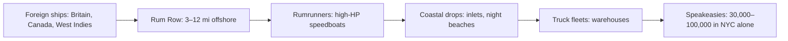
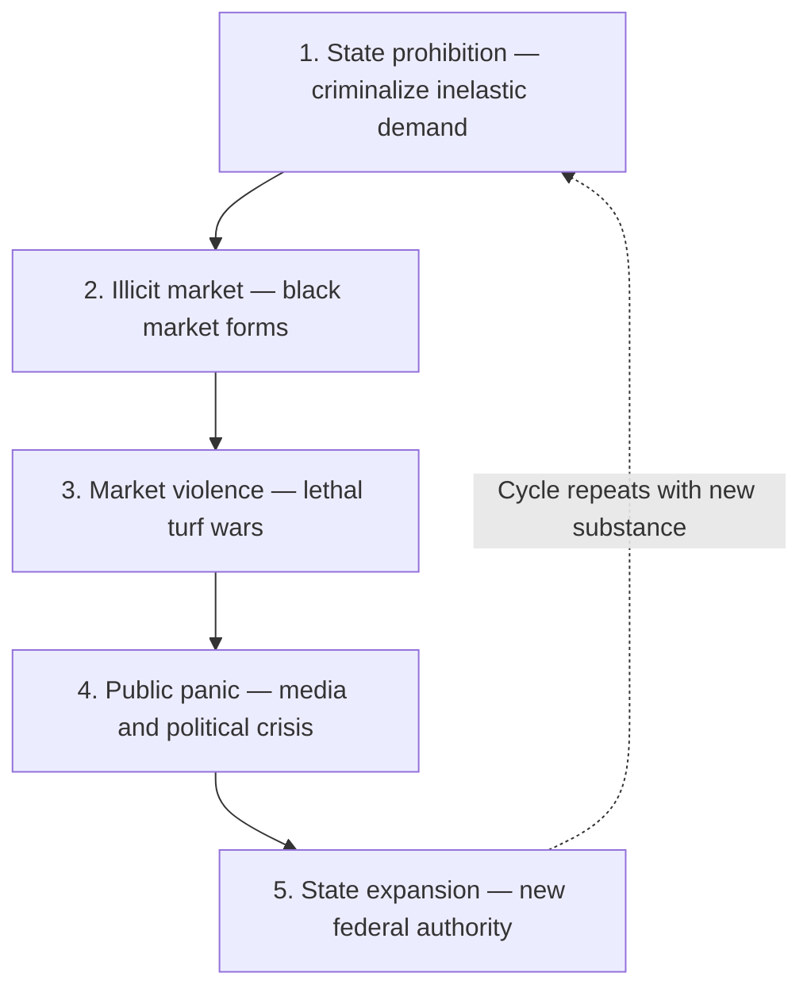

# **The Crucible of Prohibition: Illicit Markets, Organized Crime, and the Genesis of Federal Gun Control**

*Author: Emmanuel Theodore. This Markdown mirrors `Prohibition Era Violence and Gangs.tex`; LaTeX TikZ/pgfplots figures are represented below as captions plus tables or Mermaid diagrams.*

## **Introduction: The Architecture of a Criminogenic Crisis**

The enactment of the Eighteenth Amendment to the United States Constitution, followed by the enforcement mandates of the National Prohibition Act (commonly known as the Volstead Act) in 1920, initiated one of the most profound socio-economic, legal, and criminological disruptions in modern global history. Driven by the moral and progressive imperatives of the American Temperance Society, the Women’s Christian Temperance Union, and the Anti-Saloon League, this "noble experiment" sought to eradicate the social and public health ills associated with alcohol consumption. The theoretical objective was the purification of American social life, the reduction of domestic violence, the alleviation of urban poverty, and the promotion of an efficient, sober industrial workforce. The movement was further accelerated by the geopolitical environment of World War I, which fostered a need to conserve grain for troops and catalyzed domestic hostility toward German-Americans, who were heavily associated with the domestic brewing industry.  
However, the practical implementation of Prohibition yielded a catastrophic policy failure that fundamentally re-engineered the American criminal landscape. By criminalizing the production, transportation, and sale of a deeply ingrained cultural commodity for which there remained a highly inelastic public demand, the state inadvertently engineered a lucrative, unregulated underground economy of unprecedented scale. This legislative rupture catalyzed a multidimensional crisis: it transformed localized, disorganized street gangs into sophisticated, transnational criminal syndicates; it generated an unprecedented spike in lethal violence as cartels fought for market supremacy; and it thoroughly corrupted municipal and federal law enforcement agencies.  
Furthermore, the systemic violence generated by this illicit market—most visibly perpetrated with high-capacity, automatic firearms such as the Thompson submachine gun—provided the federal government with the political capital necessary to vastly expand its policing and regulatory apparatus. Just as the late twentieth-century crack cocaine epidemic and its corresponding violence were subsequently utilized by policymakers to justify the mass expansion of the carceral state and the Violent Crime Control and Law Enforcement Act of 1994, the highly publicized violence of Alcohol Prohibition was leveraged by the administration of President Franklin D. Roosevelt to justify the National Firearms Act of 1934.  
To research the etiology of Prohibition-era violence and its legislative aftermath is to recognize a recurring, systemic algorithm in American public policy: the state enforces a prohibition that inadvertently births a violent black market, and subsequently weaponizes the violence generated by that exact market to justify sweeping, permanent expansions of federal police authority. This report provides an exhaustive, expert-level diagnostic of this era, analyzing the economic mechanics of the underground alcohol trade, the professionalization and multi-generational legacy of criminal cartels, the empirical topography of the 1920s homicide surge, and the enduring jurisprudential frameworks of gun control born from the ashes of the Prohibition gang wars.

## **The Economics of the Underground: Bootlegging, Speakeasies, and the Iron Law of Prohibition**

When the Volstead Act officially took effect on January 17, 1920, it immediately mandated the closure of thousands of legal saloons, breweries, and distilleries across the United States. However, the legislation did not eliminate the public's desire for alcohol; it merely transferred the entirety of the supply chain from regulated, taxable businesses to the criminal underworld. Prohibition created a natural monopoly for organized crime, uniting disparate groups of men who had previously fought over minor neighborhood territories in a shared effort to capitalize on a multi-million dollar logistical vacuum.

### **The Infrastructure of Bootlegging and "Rum Row"**

To satisfy the immense national thirst, a complex logistical infrastructure rapidly developed. Bootlegging operations varied in scale from small-time urban distillation networks utilizing hidden "stills" to massive, international smuggling rings. One of the most prominent mechanisms for importing high-quality liquor was the establishment of "Rum Row." This phenomenon consisted of a fleet of floating liquor stores—heavily loaded supply ships carrying whiskey, rum, and champagne from Great Britain, Canada, and the West Indies—anchored in international waters just off the Eastern Seaboard.  
Initially operating three miles off the coast to remain outside U.S. legal jurisdiction, the heavily patrolled maritime boundary was eventually extended to twelve miles through subsequent international treaties. New York's Rum Row, the largest on either coast, was situated southeast of Nantucket Island and east of Long Island. Smugglers and local boat operators, known as "rumrunners," utilized highly modified, high-horsepower speedboats to outrun the underfunded and over-extended vessels of the U.S. Coast Guard, ferrying illicit cargo from the mother ships to hidden drop spots along the coastlines of New Jersey, New York, and Massachusetts.  
The cat-and-mouse game on the open water was perilous; rumrunners faced the constant threat of having their vessels seized and being assessed staggering $10,000 fines, while the Coast Guard frequently engaged in live-fire pursuits. In regions like Cape Cod and Martha's Vineyard, rumrunners utilized the dense fog, intricate coastal inlets, and night tides to evade detection, unloading cargo into dories and transferring it to waiting fleets of trucks on the beaches. Figures such as Captain Bill McCoy gained national fame operating on Rum Row; McCoy refused to dilute his imported alcohol, giving rise to the cultural idiom "the real McCoy" to denote genuine, unadulterated quality.

**Figure 1 (LaTeX `fig:rum-row-supply`).** The bootlegging supply chain from international waters to urban speakeasies. The logistical complexity of this pipeline forced criminal gangs to professionalize into corporate-style syndicates. Sources: National Archives; U.S. Coast Guard historical records; The Mob Museum.

| Annotation |
| --- |
| **Enforcement gauntlet:** ~1,500 federal agents vs. ~12,000 mi of coastline |

### **The Speakeasy and the Subversion of Cultural Norms**

Once successfully brought onshore, the alcohol was distributed to private, unlicensed barrooms famously known as "speakeasies," "blind pigs," or "gin joints". The term derived from the necessity for patrons to speak quietly and provide passwords to gain entry. The scale of this underground retail network was vast; by 1925, an estimated 30,000 to 100,000 speakeasy clubs were operating in New York City alone.  
The speakeasy culture induced a permanent, radical shift in American social dynamics and gender relations. Prior to Prohibition, drinking in legal saloons was almost exclusively a male activity, highly segregated by gender. The illicit, secretive nature of the speakeasy dissolved these traditional Victorian barriers, creating gender-integrated environments where men and women drank, socialized, and danced to the emerging sounds of jazz music. To accommodate female patrons, these underground restaurants began offering table service and live entertainment, fueling the cultural explosion of the "Roaring Twenties". The era popularized the modern concept of unsupervised "dating" among young adults and empowered the cultural icon of the "flapper," a new generation of women who defied traditional behavioral constraints.  
### **Toxicity and the "Iron Law of Prohibition"**

While high-end speakeasies in affluent urban centers served imported, high-quality liquor from Rum Row, the vast majority of the illicit alcohol consumed by the working class was domestically produced, often with lethal consequences. This phenomenon is explained by the "Iron Law of Prohibition," an economic and pharmacological principle dictating that as law enforcement pressure against an illicit substance increases, the potency and toxicity of that substance will inevitably rise.  
Because bootleggers operated under the constant threat of detection and seizure, bulky, low-potency beverages like beer and wine became economically unviable to smuggle, store, or manufacture in massive quantities. The market organically shifted toward highly concentrated, easily concealable hard liquors, maximizing the profit-to-volume ratio. Estimates suggest that the average potency of alcohol products increased by more than 150 percent during the Prohibition era compared to the periods immediately preceding and following it.  
To maximize profit margins, bootleggers frequently adulterated pure alcohol with water, artificial coloring, and dangerous chemical additives. The resulting "rotgut" or "bathtub gin" was often so foul-tasting that bartenders were forced to invent modern "cocktails," mixing the liquor with ginger ale, sugar, mint, and fruit juices to mask the flavor. More insidiously, when criminal chemists attempted to re-distill industrial alcohol—which the federal government had intentionally poisoned with denaturing additives to prevent human consumption—the results were catastrophic. Tainted liquors containing carbolic acid or pure wood alcohol (nicknamed "Smoke") caused mass casualties, killing, blinding, or paralyzing tens of thousands of Americans during the 1920s. This dynamic perfectly mirrors the contemporary "Iron Law" realities observed in modern drug markets, where the crackdown on prescription opioids inevitably led to the dominance of highly potent, highly lethal synthetic fentanyl.

**Figure 2 (LaTeX `fig:iron-law`).** The Iron Law of Prohibition dictates that enforcement pressure shifts markets toward maximum potency-per-volume. During Alcohol Prohibition, the market shifted from beer/wine to concentrated spirits and toxic "bathtub gin" (150% average potency increase). The modern War on Drugs replicated this pattern as prescription opioid crackdowns drove the market to heroin and then synthetic fentanyl (50–100× more potent). Sources: Warburton (1932); Thornton, Cato Institute (1991); DEA National Drug Threat Assessment.

| Category | Prohibition era (1920s) — relative scale | Modern drug war (2000s–2020s) — relative scale |
| --- | ---: | ---: |
| Beer (3–5%) | 5 | — |
| Wine (12%) | 12 | — |
| Spirits (40–60%) | 50 | — |
| Bathtub gin (60–90%) | 75 | — |
| Rx opioids | — | 1 |
| Heroin | — | 4 |
| Fentanyl | — | 100 |

| Warburton (1932) consumption shift |
| --- |
| **Beer:** −70% (one-third of pre-Prohibition) |
| **Wine:** +65% |
| **Spirits:** +10% (surpassed pre-Prohibition) |

## **The Metamorphosis of the Syndicate: From Street Gangs to Organized Crime**

Perhaps the most devastating long-term consequence of the Volstead Act was its role as a hyper-incubator for modern organized crime. The architectural evolution of these criminal enterprises fundamentally altered the American law enforcement landscape for the remainder of the twentieth century.  
Prior to 1920, urban criminal gangs existed almost entirely on the periphery of society. Since the nineteenth century, a social hierarchy existed wherein big-city "bosses" of political machines financed their control of local wards by accepting payments from criminals running minor gambling and prostitution rackets, subsequently bribing police to look the other way. Beneath these political bosses operated fractured, localized gangs of various ethnic groups—Irish, Italian, Jewish, and Polish—focused primarily on street-level extortion (such as the Sicilian "Black Hand" rackets), localized loan-sharking, burglary, and contract violence. These activities were rarely coordinated under a larger organizational umbrella; indeed, the term "organized crime" did not enter the popular lexicon until the Prohibition era.  
Prohibition provided these previously fractured groups with an unprecedented, astronomical economic engine. The logistical demands of the bootlegging industry—purchasing defunct breweries, acquiring fleets of armored trucks and speedboats, managing complex international supply chains, coordinating thousands of speakeasies, and laundering millions of dollars—required a level of organization that completely transcended traditional street crime. Criminals were forced to evolve into corporate executives, employing lawyers, accountants, brewmasters, and heavily armed enforcers known as "torpedoes". The death of a single leader no longer destroyed the gang; much like a legitimate corporation, a new executive officer simply stepped into the vacated position.

### **The Cartels of Chicago and New York**

In Chicago, the illegal alcohol market was aggressively consolidated by the Chicago Outfit, a syndicate initially organized by Johnny Torrio and subsequently inherited by his protégé, Al "Scarface" Capone, in 1925 following the violent "Beer Wars". Under Capone's ruthless leadership, the Outfit's operations spanned liquor distribution, speakeasy ownership, prostitution, and gambling, generating an estimated $100 million in annual revenue by the late 1920s (equivalent to roughly $1.4 billion today). Capone secured his empire through staggering systemic corruption, reportedly distributing $500,000 monthly to bribe police officers, judges, and politicians, allowing his organization to operate with absolute impunity.  
In New York, a similar professionalization occurred under the guidance of visionary mobsters like Arnold Rothstein, Meyer Lansky, and Charles "Lucky" Luciano. Rothstein, often credited with recognizing the corporate potential of the underworld, served as a financier and mentor to younger gangsters, demonstrating how to bridge the gap between street violence and white-collar commerce. Luciano revolutionized the structural architecture of the Italian-American Mafia. Recognizing that continuous, chaotic turf wars disrupted revenue streams, Luciano orchestrated the assassination of old-guard Sicilian bosses (the "Mustache Petes" like Giuseppe Masseria and Salvatore Maranzano). He reorganized the New York underworld into the "Five Families" (Gambino, Genovese, Lucchese, Bonanno, and Colombo) and established "The Commission" in 1931—a national board of directors composed of crime family bosses designed to mediate disputes, allocate territories, and coordinate operations across ethnic lines.

### **The New England Ecosystem: A Generational Case Study**

The evolution of organized crime was not limited to the primary hubs of Chicago and New York; it profoundly altered regional ecosystems, as vividly illustrated by the history of Boston and the broader New England area. Analyzing the gang structures of Massachusetts provides a perfect case study of how Prohibition forged criminal empires that dominated the region for decades.  
In the early phases of Prohibition, the Boston underworld was dominated by the Gustin Gang, an Irish-American syndicate led by Frank Wallace and his brothers Steve and Jim. Originating in the mid-1910s as the "Tailboard Thieves" who looted delivery trucks at intersections in South Boston ("Southie"), the Gustin Gang transitioned aggressively into the bootlegging trade in the 1920s. Lacking the massive capital, international connections, and extensive shipping fleets of other syndicates, the Wallace brothers relied heavily on brute force, extortion, and ingenuity. They frequently engaged in high-stakes hijacking, utilizing counterfeit badges resembling those of federal Prohibition agents to easily confiscate alcohol shipments from rival bootleggers. They subsequently delivered these stolen shipments to their own networks, including a speakeasy owned by their older brother Billy Wallace, known as "The Sportlight," located on Old Colony Avenue.  
The Gustin Gang operated with a startling degree of legal immunity throughout the 1920s. Despite being arrested more than 25 times for offenses ranging from armed robbery to assault and battery, Frank Wallace rarely served prison time. This immunity was secured through deep, systemic political corruption; one of the gang’s primary attorneys was John W. McCormack, a powerful state senator who would later become the Speaker of the United States House of Representatives.  
However, the localized dominance of the Irish gangs was eventually eclipsed by the superior organization, ruthlessness, and financial leverage of Italian-American and Jewish factions. In December 1931, the reign of the Gustin Gang ended abruptly when Frank Wallace and his lieutenant Bernard "Dodo" Walsh were ambushed and assassinated during a "sit-down" meeting with Italian gangsters, including Joe Lombardo, at a North End importing company.  
The power vacuum left by the collapse of the Gustin Gang allowed other figures to rise, notably the powerful Jewish mob boss Charles "King" Solomon, who controlled vast swaths of Boston's bootlegging, narcotics, and bail bond rackets. However, the drive toward absolute monopolization was relentless. Solomon was murdered in 1933 at the behest of Filippo Buccola, an East Boston mobster seeking total consolidation of the region's rackets. Buccola's successful elimination of rivals allowed him to formally merge the Boston Mafia with the Providence, Rhode Island faction (formerly led by Frank Morelli) in 1932, creating a unified, highly structured New England crime family.  
In 1954, Buccola retired to Sicily, officially handing control of this massive, multi-state enterprise to Raymond Patriarca. Patriarca would rule the New England underworld with an iron fist for the next three decades from his headquarters in Providence, utilizing the vast wealth and structural foundations laid during the bloody bootlegging wars of the 1920s. The legacy of the Prohibition-era Irish gangs also survived; the remnants of the Gustin Gang's territory eventually gave rise to the notorious Winter Hill Gang in the 1960s and 1970s, led by figures like James "Buddy" McLean, Howie Winter, and eventually James "Whitey" Bulger, who engaged in a multi-decade war with the Patriarca family. Thus, the territorial lines and gangland rivalries that defined New England through the end of the 20th century were the direct, downstream results of the illicit alcohol markets forged in the 1920s.

## **The Empirical Topography of Prohibition-Era Violence**

Because participants in an illicit black market are fundamentally excluded from the state's legal mechanisms for dispute resolution—they cannot sue a supplier for breach of contract, nor call the police if their inventory is stolen—violence becomes the mandatory, structural mechanism for enforcing contracts, collecting debts, and protecting market share. During the Prohibition era, this reliance on "competitive violence" caused a staggering surge in the national homicide rate, mirroring the later spikes seen during the 1980s crack cocaine epidemic.

### **Statistical Trajectories of Lethal Violence**

Analyzing crime data from the early twentieth century presents distinct methodological challenges, as the FBI's Uniform Crime Reporting (UCR) program was not standardized until 1930, and early state-level reporting was highly fragmented. However, utilizing reconstructed historical census data, vital health statistics, and localized datasets, criminologists and historians have mapped a clear, undeniable trajectory of violence directly corresponding to the enactment and subsequent repeal of the 18th Amendment.  
Prior to the onset of Prohibition, the national homicide rate hovered consistently between 4.5 and 6 deaths per 100,000 population. Following the passage of the Volstead Act, this rate began a sustained, precipitous climb, peaking at an estimated 9.8 to 10 homicides per 100,000 residents in 1933. This represented a massive increase of roughly 78 percent over the pre-Prohibition baseline.  
**Table 1: Estimated U.S. Homicide Trajectory (per 100,000 population), 1910 - 1940**

| Year / Era | Homicide Rate (per 100,000) | Contextual Notes |
| :---- | :---- | :---- |
| 1910 | ~ 4.6 | Pre-Prohibition baseline |
| 1915 | ~ 5.9 | Pre-Prohibition baseline |
| 1920 | ~ 6.8 | First year of National Prohibition |
| 1925 | ~ 8.6 | Escalation of gang territorial wars |
| 1929 | ~ 8.8 | Year of the St. Valentine's Day Massacre |
| 1933 | ~ 9.8 | Peak violence; 21st Amendment ratified (Repeal) |
| 1936 | ~ 8.0 | Post-Repeal decline accelerates |
| 1940 | ~ 6.2 | Return to near pre-Prohibition levels |

*Data synthesized from historical U.S. Vital Statistics, Bureau of the Census reconstructions, and BJS Homicide Trends.*

**Figure 3 (LaTeX `fig:homicide-rate`).** U.S. homicide rate trajectory showing the direct correspondence between Prohibition (1920–1933) and the surge in lethal violence. The rate climbed 78% above pre-Prohibition baselines, peaking in 1933, then fell sharply following Repeal. The green band in the PDF indicates the pre-Prohibition baseline range (4.5–6.0 per 100,000). Sources: BJS Homicide Trends; CDC Vital Statistics; Bureau of the Census reconstructions.

| Year | Homicide rate (per 100,000) | Policy notes (PDF figure) |
| --- | ---: | --- |
| 1910 | 4.6 | Pre-Prohibition baseline band 4.5–6.0 |
| 1912 | 5.2 | |
| 1915 | 5.9 | |
| 1918 | 6.5 | |
| 1920 | 6.8 | Volstead Act |
| 1922 | 7.4 | |
| 1925 | 8.6 | |
| 1927 | 8.4 | |
| 1929 | 8.8 | St. Valentine's Massacre |
| 1931 | 9.2 | |
| 1933 | 9.8 | 21st Amendment / Repeal (peak) |
| 1935 | 8.4 | |
| 1936 | 8.0 | |
| 1938 | 6.8 | |
| 1940 | 6.2 | |

Additional verticals in the PDF: **1926** Peak Beer Wars; **1934** NFA.

The sheer volume of urban violence was staggering. In 1926 alone, more than 12,000 murders were recorded across the United States. While some contemporaries argued that the perceived "crime wave" was merely media sensationalism, detailed analyses prove that while minor public order offenses (such as vagrancy or public swearing) decreased, severe violent crimes skyrocketed. Between 1910 and 1923, national robbery rates surged by 83.3 percent, and homicides increased by 16.1 percent, directly correlating with the rise of the illegal traffic.

### **Systemic vs. Psychopharmacological Violence**

A rigorous epidemiological analysis of the Chicago Historical Homicide Project—a dataset chronicling 11,018 homicides between 1870 and 1930—reveals the precise nature of this violence. Using interrupted time-series and ARIMA models, researchers demonstrated that during Prohibition, total homicides in Chicago increased by 21 percent, and non-alcohol-related homicides increased by 11 percent. Crucially, the rate of homicides committed by individuals under the direct influence of alcohol remained statistically unchanged throughout the era.  
This divergence is analytically profound. It proves that the surge in murders was not the "psychopharmacological" result of citizens becoming intoxicated and violent, but rather the structural byproduct of intense, competitive market violence between rival bootlegging factions fighting for control of distribution networks.  
Public health scholarship further corroborates the continued consumption of alcohol despite the ban. In New Orleans, despite Prohibition enforcement, the death rate from liver cirrhosis rose by 25.1 percent between 1920 and 1929, indicating that massive quantities of toxic illicit alcohol were still being consumed. Yet, when Prohibition ended in 1933, the cirrhosis death rate plummeted by 34.7 percent over the next decade as the market re-regulated, mirroring the simultaneous, steep collapse in the national homicide rate.

**Figure 4 (LaTeX `fig:chicago-decomposition`).** Decomposition of the Prohibition-era homicide increase in Chicago (1870–1930 dataset, 11,018 cases). The 21% total increase was driven entirely by non-alcohol-related systemic violence between rival bootlegging factions, while homicides committed under the influence of alcohol remained statistically unchanged—proving the violence was a structural market output, not a behavioral consequence of intoxication. Source: Asbridge & Weerasinghe (2009), Chicago Historical Homicide Project; ARIMA time-series analysis.

| Metric | Change during Prohibition |
| --- | ---: |
| Total homicides | +21% |
| Non-alcohol homicides | +11% |
| Alcohol-influenced homicides | 0% (unchanged) |

*PDF callout:* The surge was **systemic market violence** (turf wars, contract enforcement), not psychopharmacological violence from intoxication. *Note:* 32.8% of victims in the 1870–1930 dataset tested positive for alcohol, but this rate did not increase during Prohibition.

## **Enforcement Asymmetries and the Failure of the State**

The inability of the state to curb the rising tide of violence was rooted in a profound asymmetry of resources, training, and systemic integrity. The National Prohibition Act tasked the commissioner of the Internal Revenue Service (IRS) within the Treasury Department with overseeing enforcement. The IRS established the Prohibition Unit, initially deploying a meager force of only 1,500 agents to police the entire geography of the United States—encompassing 12,000 miles of shoreline, 3,900 miles of international borders, and a population eager to consume alcohol.  
The enforcement apparatus was chronically underfunded; in 1923, the federal government and states combined spent less than $500,000 on enforcement efforts. Furthermore, Prohibition agents (nicknamed "Prohis") were initially exempt from Civil Service exam requirements, leading to rampant political cronyism and the hiring of agents with highly questionable backgrounds. Issued firearms but lacking formal training, these agents were highly susceptible to corruption. Given that an agent's salary ranged from a paltry $1,200 to $3,000 annually, the temptation to accept bribes from bootleggers generating millions was irresistible. By 1930, 1,587 federal Prohibition employees had been officially terminated for offenses including perjury, robbery, bribery, and embezzlement.  
Despite the systemic rot, certain federal actors achieved legendary status through innovative, albeit insufficient, enforcement tactics. Agents Izzy Einstein and Moe Smith became national sensations by utilizing elaborate theatrical disguises—posing as firemen, gravediggers, and football players—to infiltrate and raid thousands of speakeasies in New York. In Chicago, Special Agent Eliot Ness famously assembled a handpicked detail of incorruptible agents, dubbed the "Untouchables," to physically dismantle Al Capone’s illicit breweries and distribution networks.  
Ultimately, traditional law enforcement tactics proved inadequate against deeply entrenched syndicates. The federal government was forced to pivot its legal strategy. Led by Elmer Irey of the Special Intelligence Unit, the Treasury Department utilized a 1927 Supreme Court ruling (the Manly Sullivan case), which determined that illegal income was subject to federal income tax. By deploying forensic accountants to track money laundering, the federal government successfully prosecuted Al Capone not for bootlegging or murder, but for felony tax evasion, sentencing him to 11 years in federal prison in 1931.

**Figure 5 (LaTeX `fig:enforcement-asymmetry`).** The structural asymmetry between federal enforcement resources and the scale of the illicit alcohol economy. With only 1,500 agents earning $1,200–$3,000 annually and a combined enforcement budget under $500,000, the state was outmatched by an underground economy generating over $100 million annually for a single syndicate. By 1930, 1,587 agents had been terminated for corruption. Sources: Prohibition Bureau records; Cato Institute (1991); DOJ historical reports.

| Dimension | Federal enforcement (approx.) | Criminal underworld (approx.) |
| --- | --- | --- |
| Salaries vs. syndicate revenue | $2.1K agent pay vs. **$100M** Outfit revenue | |
| Agents vs. speakeasies (NYC scale) | **1.5K** agents vs. **~100K** clubs | |
| Budget vs. market size | **$0.5M** combined enforcement vs. **~$3B** illicit market | |

*(The PDF figure uses log-scale bars for these comparisons.)*

## **The Catalyst of Atrocity: The St. Valentine's Day Massacre**

While statistical data outlines the macro-level tragedy of the era, the political and cultural shift regarding Prohibition was driven by highly visible, spectacular acts of public violence. The apex of this brutality—and the catalyst for sweeping federal legislative reform—occurred on the morning of February 14, 1929, in an event universally known as the St. Valentine's Day Massacre.  
In Chicago, the vicious territorial rivalry between Al Capone's Italian South Side Outfit and George "Bugs" Moran's predominantly Irish North Side Gang had raged for years, resulting in hundreds of mobster and police casualties. Seeking to permanently eradicate Moran's operation, Capone's associates orchestrated a meticulously planned ambush.  
Seven members and associates of the North Side Gang were lured to a garage at 2122 N. Clark Street under the pretense of receiving a hijacked, discounted shipment of imported whiskey. Four men—two of whom were dressed in stolen Chicago Police Department uniforms—entered the garage, ordered the men to line up facing the rear brick wall, and executed them. The executioners utilized two Thompson submachine guns and two shotguns, unleashing a devastating barrage of 70 rounds into the victims' backs and heads.  
Although Moran himself narrowly escaped (having arrived late and spotted the "police" entering), his criminal empire was effectively crippled. Capone, who conveniently established a highly public alibi by vacationing in Florida, was universally recognized as the architect of the slaughter, though neither he nor his suspected hitmen (such as Fred Burke) were ever successfully prosecuted for the massacre.  
The St. Valentine's Day Massacre acted as a profound psychological interface shift for the American electorate. Prior to 1929, many citizens viewed bootleggers as romanticized, anti-establishment figures providing a desired service in defiance of an unpopular law. The sheer barbarity of the garage executions, captured in gruesome press photographs and disseminated nationally, evaporated this public sympathy. The massacre forced the federal government to acknowledge that municipal police forces were entirely outgunned and hopelessly corrupted, necessitating a highly aggressive, federalized response to combat organized crime.

## **The Legislative Architecture: The National Firearms Act of 1934**

The extreme violence of the Prohibition era provided the federal state with the essential political leverage to construct the foundational architecture of modern American gun control.  
The signature weapon of the era's gangland warfare was the Thompson submachine gun. Invented by John T. Thompson in 1918 and originally intended for trench warfare, the "Tommy Gun" fired heavy .45 ACP ammunition at a cyclic rate of 600 to 900 rounds per minute. Equipped with 50- or 100-round drum magazines and easily concealable beneath a top coat, the weapon provided unprecedented, squad-level automatic firepower to single individuals. Because the weapon was legally available for commercial purchase by the general public, it was rapidly adopted by syndicates and bank robbers, earning the grim moniker the "Chicago Typewriter".  
As the national homicide rate climbed to its 1933 peak, and following a highly publicized assassination attempt on President-elect Franklin D. Roosevelt in 1933, the newly formed administration declared a national "War on Crime". Tasked with dismantling the syndicates, Attorney General Homer S. Cummings recognized that a patchwork of local ordinances was entirely insufficient to combat heavily armed, interstate cartels. Cummings drafted what would become the National Firearms Act (NFA) of 1934, the first comprehensive federal firearm legislation in U.S. history.

### **The Mechanics of the NFA: Taxation as Regulation**

The legislative strategy behind the NFA was profoundly shaped by the constitutional constraints of the era. In the 1930s, the prevailing interpretation of the Second Amendment, combined with strict limits on the Interstate Commerce Clause, posed significant barriers to an outright federal ban on firearms. To circumvent this, Cummings and the Department of Justice ingeniously utilized Congress's enumerated Article I power to levy taxes.  
During his testimony before the House Committee on Ways and Means, Cummings employed highly inflammatory rhetoric to mobilize legislative action, declaring that the "armed underworld" rivaled the size of the U.S. Army and referring to gangsters as "predatory criminals" posing a "serious national emergency". When questioned regarding the constitutionality of the bill by Congressman Hatton Sumners, Cummings explicitly admitted the legislative sleight-of-hand: “If we had a statute absolutely forbidding any human being to have a machine gun, you might say there is some constitutional question involved. But when you say, ‘we will tax the machine gun,’ … you are easily within the law”.  
The original draft of the NFA (H.R. 9066) sought to require registration and heavy taxation on all concealable firearms, including standard pistols and revolvers, as well as machine guns. However, intense lobbying by the National Rifle Association (NRA) forced a critical compromise; handguns were stripped from the final legislation.  
The finalized National Firearms Act of 1934 mandated the registration of specific "gangster weapons"—defined as machine guns, short-barreled (sawed-off) rifles and shotguns, and firearm silencers/mufflers—with the Secretary of the Treasury. The Act imposed a staggering $200 transfer and making tax on these items. In 1934, when a brand new Thompson submachine gun cost approximately $175, the $200 tax (equivalent to roughly $3,600 in modern inflation-adjusted currency) effectively doubled or tripling the cost of the weapon.  
**Table 2: Original NFA Weapon Categorizations and Tax Structures (1934)**

| Firearm Category | Definition Parameters | Regulatory Action | Purpose / Target Demographic |
| :---- | :---- | :---- | :---- |
| **Machine Guns** | Any weapon shooting automatically more than one shot without manual reloading. | $200 Tax + Registration | Target cartel enforcers (Thompson SMG). |
| **Short-Barreled Shotguns** | Shotgun having a barrel less than 18 inches in length. | $200 Tax + Registration | Target easily concealable bank robbery tools. |
| **Short-Barreled Rifles** | Rifle having a barrel less than 16 inches in length. | $200 Tax + Registration | Target easily concealable long guns. |
| **Silencers/Mufflers** | Device for silencing, muffling, or diminishing the report of a portable firearm. | $200 Tax + Registration | Target assassination tools used by hitmen. |
| **Pistols/Revolvers** | Standard handguns. | *Removed from Bill* | Originally targeted, removed via NRA lobbying. |

**Figure 6 (LaTeX `fig:nfa-tax`).** The NFA's $200 transfer tax shown against the base cost of each regulated weapon category. The tax effectively doubled the cost of a Thompson submachine gun and increased the cost of cheaper weapons by 670–1,300%, achieving *de facto* prohibition through prohibitive pricing. Handguns were originally included but removed via NRA lobbying. Sources: ATF NFA historical records; House Ways and Means Committee hearings (1934).

| Item | Base cost ($, 1934) | NFA tax ($) |
| --- | ---: | ---: |
| Thompson SMG | 175 | 200 |
| Sawed-off shotgun | 25 | 200 |
| Short-barreled rifle | 30 | 200 |
| Silencer | 15 | 200 |
| NFA tax (benchmark) | — | 200 |

*PDF annotations:* **Handguns removed (NRA).** **$200 in 1934 ≈ $3,600 today.** For a $25 sawed-off shotgun, the tax represented an **800%** price increase—prohibition via taxation.

The underlying purpose of the NFA was explicitly not revenue collection, but absolute prohibition via prohibitive pricing and strict registration requirements (which included fingerprinting and photographing applicants). As Cummings intended, while wealthy cartel bosses like Capone could easily afford the $200 tax, they actively avoided registration to prevent providing federal agents with documented proof of their identities, locations, and arsenals. Consequently, the mere possession of an unregistered NFA weapon became a federal felony, providing the fledgling FBI and Treasury agents with a powerful legal mechanism to arrest and imprison mobsters when underlying charges of murder or extortion could not be proven in local courts.  
The NFA faced subsequent legal challenges, but its framework was upheld by the Supreme Court in cases such as *Sonzinsky v. United States* (1937), which validated the taxing mechanism, and *United States v. Miller* (1939), which ruled that the Second Amendment did not protect weapons (like sawed-off shotguns) that lacked a reasonable relationship to the preservation of a well-regulated militia. The success of the NFA in practically eliminating the legal commercial market for fully automatic weapons established a durable jurisprudential architecture. By successfully utilizing the tax code to enact sweeping social control, the Roosevelt administration set a profound legal precedent that would shortly be used to draft the Marihuana Tax Act of 1937, officially launching the federal war on drugs using the exact same constitutional mechanism.

## **Retrospective Diagnostics: Repeal and the Post-Prohibition Landscape**

By the early 1930s, the "noble experiment" was universally recognized as an abysmal public policy failure. The Volstead Act had not only failed to prevent the consumption of alcohol, but it had also birthed a multi-million-dollar criminal underworld, thoroughly corrupted the judiciary, and flooded city streets with automatic weapon fire. The onset of the Great Depression in 1929 fundamentally altered the political and economic calculus; the federal government, desperate for tax revenue and job creation, could no longer afford to squander millions of dollars enforcing a widely despised law while surrendering billions in potential excise taxes to criminal cartels.  
In the 1932 presidential election, Franklin D. Roosevelt campaigned aggressively on a platform of Repeal. Following his landslide victory, Congress quickly passed the Cullen-Harrison Act in March 1933, legalizing low-alcohol beer (3.2 percent) and light wines. Months later, on December 5, 1933, the Twenty-First Amendment was officially ratified by state conventions, repealing the Eighteenth Amendment and bringing National Prohibition to an end.

### **The Great Crime Decline of the 1930s**

The sociological impact of Repeal was immediate and undeniable. With the stroke of a pen, the primary economic engine of the criminal underworld was obliterated. Because legitimate corporations and heavily regulated taverns reclaimed the alcohol market, contractual disputes over territory and supply were once again settled in courtrooms through civil litigation rather than with Thompson submachine guns in alleyways.  
Consequently, the national homicide rate, which had peaked in 1933, underwent a dramatic, sustained reversal. Urban centers that had served as the primary battlegrounds for the bootlegging wars saw astonishing drops in violence by the end of the decade. Between 1933 and 1940, Detroit's homicide rate plummeted by 66.3 percent, New Orleans by 56.6 percent, New York City by 41.8 percent, and Chicago by 33.1 percent. This sharp decline continued steadily through the 1940s and 1950s, conclusively proving that the extraordinary violence of the 1920s was a direct, localized symptom of the prohibitionary market structure.

**Figure 7 (LaTeX `fig:post-repeal-decline`).** The dramatic collapse in urban homicide rates following the repeal of Prohibition in 1933. Detroit, one of the primary border smuggling corridors from Canada, experienced the steepest decline (66.3%). The sharp, synchronized drop across all major cities proves the violence was a direct structural output of the illicit market, not an endemic cultural condition. Sources: BJS Homicide Trends; CDC Vital Statistics.

| City | Homicide rate decline (1933–1940) |
| --- | ---: |
| Chicago | −33.1% |
| New York City | −41.8% |
| New Orleans | −56.6% |
| Detroit | −66.3% |

### **The Organizational Pivot of the Underworld**

While the violence receded, the organizational infrastructure created by Prohibition did not vanish; it adapted. The massive influx of capital amassed during the 1920s provided mob bosses like Meyer Lansky, Frank Costello, and the leaders of the Chicago Outfit with the resources to transition into other highly lucrative, illicit fields.  
The cartels seamlessly pivoted their sophisticated logistical networks toward illegal gambling, extortion, labor union racketeering, and, most consequentially, the burgeoning international narcotics trade. Former rum-running fleets were repurposed for smuggling heroin and cocaine. The vast wealth accumulated from bootlegging was also heavily invested in the nascent, legal casino industry in Las Vegas by figures such as Benjamin "Bugsy" Siegel and Moe Dalitz in the 1940s. Ultimately, while Prohibition failed to dry up America, it succeeded in corporatizing the American Mafia, providing them with the organizational blueprint and financial war chest that would sustain their illicit operations for the next half-century.  
Simultaneously, the federal law enforcement apparatus that had been rapidly expanded to fight the bootleggers and "Public Enemies"—specifically the FBI under J. Edgar Hoover and the Treasury Department's Intelligence Units under Elmer Irey—retained their enhanced budgets, personnel, and statutory authority. The bureaucratic infrastructure built to wage the War on Crime in the 1930s became a permanent fixture of the state, fundamentally shifting the balance of police power from local municipalities to the federal government.

**Figure 8 (LaTeX `fig:prohibition-algorithm`).** The recurring state algorithm identified across both prohibition eras: the state criminalizes inelastic demand, generating a violent black market, then leverages that violence to permanently expand federal police authority. The 1920s Alcohol Prohibition → NFA/FBI cycle was replicated precisely by the War on Drugs → 1994 Crime Bill/DEA cycle sixty years later. The cycle is self-reinforcing: expanded authority enables further prohibition, which generates further violence.

| Parallel (PDF figure) | 1920s | 1980s–90s |
| --- | --- | --- |
| Prohibition instrument | Volstead Act (1920) | CSA / War on Drugs |
| Illicit market | Bootlegging, Rum Row | Crack trade, drug cartels |
| Violence spike | Gang wars, St. Valentine's | Crack epidemic, homicide surge |
| Panic framing | "War on Crime" | "Superpredator" discourse |
| State expansion | NFA (1934), FBI growth | 1994 Crime Bill, DEA, prison spending |

## **Conclusion**

The violent saga of the Prohibition era stands as a premier historical case study in the unintended, devastating externalities of absolute legislative prohibition. By attempting to legislate morality and engineer social purity through the Volstead Act, the United States government inadvertently engineered a highly profitable, violently competitive black market. This environment transformed decentralized, local street gangs into formidable, heavily armed transnational syndicates capable of rivaling the state in both wealth and localized power.  
The empirical data demonstrates that the historic surge in homicides during the 1920s was not a failure of public morality or a symptom of mass intoxication, but a predictable, structural output of an illicit economy where lethal violence served as the sole available mechanism for market regulation. When this violence reached an intolerable zenith—typified by the public atrocity of the St. Valentine's Day Massacre—the state responded not by examining the root economic causes of the violence, but by leveraging the crisis to aggressively expand its regulatory reach. The passage of the National Firearms Act of 1934 established a foundational constitutional workaround, utilizing punitive taxation to enact the nation's first sweeping federal gun control, targeting the exact weapons the state's policies had made necessary for criminal survival.  
While the repeal of Prohibition in 1933 successfully collapsed the homicide rate by removing the economic incentive for bootlegging violence, the architectural legacy of the era remains permanently etched into the nation's fabric. The "noble experiment" forged both the sophisticated operational structure of the modern American Mafia and the expansive, federalized law enforcement and gun control apparatus built to combat it. Recognizing these interwoven frameworks through rigorous historical analysis remains essential for understanding how state interventions shape, accelerate, and occasionally institutionalize the very violence they are theoretically designed to suppress.

#### **Works cited**

1. Prohibition Profits Transformed the Mob, https://prohibition.themobmuseum.org/the-history/the-rise-of-organized-crime/the-mob-during-prohibition/
2. Prohibition Agents Lacked Training, Numbers to Battle Bootleggers, https://prohibition.themobmuseum.org/the-history/enforcing-the-prohibition-laws/law-enforcement-during-prohibition/
3. Prohibition and the Rise of the American Gangster - Pieces of History, https://prologue.blogs.archives.gov/2012/01/17/prohibition-and-the-rise-of-the-american-gangster/
4. Unintended Consequences | Prohibition | Ken Burns - PBS, https://www.pbs.org/kenburns/prohibition/unintended-consequences
5. American organized crime of the 1920s | History | Research Starters - EBSCO, https://www.ebsco.com/research-starters/history/american-organized-crime-1920s
6. Prohibition in the Federal Courts: A Timeline, https://www.fjc.gov/history/exhibits/prohibition-in-federal-courts-timeline
7. Gangsters of the Prohibition era | History | Research Starters - EBSCO, https://www.ebsco.com/research-starters/history/gangsters-prohibition-era
8. Alcohol Prohibition Was a Failure - Cato Institute, https://www.cato.org/policy-analysis/alcohol-prohibition-was-failure
9. The other massacre on Valentine's Day that changed gun laws - Poynter, https://www.poynter.org/reporting-editing/2018/the-other-massacre-on-valentines-day-that-changed-gun-laws/
10. Federal Firearms Laws: Overview and Selected Legal Issues for the 116th Congress, https://www.everycrsreport.com/reports/R45629.html
11. The Speakeasies of the 1920s - Prohibition: An Interactive History - The Mob Museum, https://prohibition.themobmuseum.org/the-history/the-prohibition-underworld/the-speakeasies-of-the-1920s/
12. Smugglers, Bootleggers, Scofflaws | National Archives, https://www.archives.gov/publications/prologue/2011/fall/smugglers-bootleggers-scofflaws
13. Cape Cod Rum Runners, https://capecodlife.com/cape-cod-rum-runners/
14. The Long Blue Line: Catching the rumrunners—Coast Guard adopts new technology during Prohibition, https://www.mycg.uscg.mil/News/Article/2843288/the-long-blue-line-catching-the-rumrunnerscoast-guard-adopts-new-technology-dur/
15. Prohibition on Martha's Vineyard and Nantucket | Smugglers and Bootleggers and New York City, https://smugglersbootleggersandscofflaws.com/prohibition-and-marthas-vineyard-nantucket/
16. Rum Runners - Historic Ipswich, https://historicipswich.net/2021/06/05/rum/
17. Prohibition in the United States - Wikipedia, https://en.wikipedia.org/wiki/Prohibition_in_the_United_States
18. We Can't Go Cold Turkey: Why Suppressing Drug Markets Endangers Society, https://ycsg.yale.edu/sites/default/files/files/we_can't_go_cold_turkey.pdf
19. Regulation - Global Commission on Drug Policy, https://www.globalcommissionondrugs.org/wp-content/uploads/2018/09/ENG-2018_Regulation_Report_WEB-FINAL.pdf
20. The FBI and the American Gangster, 1924-1938, https://www.fbi.gov/history/brief-history/the-fbi-and-the-american-gangster
21. What Is The Best Murder Mystery Game Theme Era? 1920s Prohibition and Speakeasies, https://mastersofmystery.com/blogs/latest/prohibition-and-speakeasies-what-makes-the-1920s-the-best-murder-mystery-era
22. Gustin Gang - Wikipedia, https://en.wikipedia.org/wiki/Gustin_Gang
23. Patriarca crime family - Wikipedia, https://en.wikipedia.org/wiki/Patriarca_crime_family
24. Courier Gazette : August 29, 1922 - CORE, https://files01.core.ac.uk/download/pdf/270234055.pdf
25. Raymond Patriarca - The Mob Museum, https://themobmuseum.org/notable_names/raymond-patriarca/
26. Murder and the black market: Prohibition's impact on homicide rates in American cities - HOPLOFOBIA.INFO, https://www.hoplofobia.info/wp-content/uploads/2013/10/2016-Prohibitions-Impact-on-Homicide-Rates-in-American-Cities.pdf
27. “Striking the Roots of Crime: The Impact of the New Deal on Criminal Activity” Ryan S. Johnsona, Shawn Kantorb, and Price V, https://economics.ucr.edu/wp-content/uploads/2019/11/04-06-05ShawnKantor.pdf
28. Homicide trends in the United States - Bureau of Justice Statistics, https://bjs.ojp.gov/content/pub/pdf/htius.pdf
29. Homicide Trendsin the United States, 1900-74 - CDC Stacks, https://stacks.cdc.gov/view/cdc/65093/cdc_65093_DS1.pdf
30. Homicide in Chicago from 1890 to 1930: prohibition and its impact on alcohol - PubMed, https://pubmed.ncbi.nlm.nih.gov/19207343/
31. Homicide Rates and Mortality Trends: Perspectives from Public-Health Scholarship, https://journals.openedition.org/chs/2025
32. The Repeal of Prohibition, https://prohibition.themobmuseum.org/the-history/the-end-of-prohibition/repeal-of-prohibition/
33. Saint Valentine's Day Massacre - Wikipedia, https://en.wikipedia.org/wiki/Saint_Valentine%27s_Day_Massacre
34. Bootleggers and Bathtub Gin - Prohibition: An Interactive History - The Mob Museum, https://prohibition.themobmuseum.org/the-history/the-prohibition-underworld/bootleggers-and-bathtub-gin/
35. Inside the Prohibition Era: Speakeasies and Bootleggers | UT Permian Basin Online, https://online.utpb.edu/about-us/articles/humanities/inside-the-prohibition-era-speakeasies-and-bootleggers
36. Michigan and the St. Valentine's Day Massacre - Michiganology, https://michiganology.org/stories/michigan-and-the-st-valentines-day-massacre/
37. That Time Mob Violence Inspired Gun Control in America | National Geographic, https://www.nationalgeographic.com/science/article/united-states-machine-gun-ban
38. Gangsters During the Depression | American Experience | Official Site - PBS, https://www.pbs.org/wgbh/americanexperience/features/dillinger-gangsters-during-depression/
39. FEDERAL BUREAU OF INVESTIGATION UNITED STATES DEPARTMENT OF JUSTICE - LEB, https://leb.fbi.gov/file-repository/archives/december-1938.pdf
40. The First Valentine's Day Massacre Changed Gun Laws – Will This One? - Azhari LLC, https://azharillc.com/blog/the-first-valentines-day-massacre-changed-gun-laws-will-this-one/
41. National Firearms Act - ATF, https://www.atf.gov/rules-and-regulations/laws-alcohol-tobacco-firearms-and-explosives/national-firearms-act
42. Thompson submachine gun - Wikipedia, https://en.wikipedia.org/wiki/Thompson_submachine_gun
43. The Valentine's Day Massacre Tommy Guns and Birth of the NFA - Free Range American, https://freerangeamerican.us/valentines-day-massacre-gun-control/
44. Fulbright's U.S. History - Gun Control Case Study H.R. 9006 National Firearms, https://sites.google.com/view/fulbrights-u-s-history/gun-control-case-study-h-r-9006-national-firearms
45. FBI Boston History — FBI, https://www.fbi.gov/history/field-office-histories/boston
46. “To Wage a War”: Crime, Race, and State Making in the Age of FDR | Studies in American Political Development - Cambridge University Press, https://www.cambridge.org/core/journals/studies-in-american-political-development/article/to-wage-a-war-crime-race-and-state-making-in-the-age-of-fdr/332D9E4AB9A4E412FA351EE686F39C66
47. Well Regulated: The NFA hearings (2/6) – 4/16/1934 - The Cornell Review, https://www.thecornellreview.org/well-regulated-the-nfa-hearings-2-6-4-16-1934/
48. How to Start (or Stop) a War on Crime: A Conceptual Cookbook - The Reading Room - Georgia State University, https://readingroom.law.gsu.edu/cgi/viewcontent.cgi?article=3345&context=gsulr
49. Dangerous and Unusual: How an Expanding National Firearms Act Will Spell Its Own Demise, https://insight.dickinsonlaw.psu.edu/cgi/viewcontent.cgi?article=1165&context=dlr
50. National Firearms Act of 1934 | Law | Research Starters - EBSCO, https://www.ebsco.com/research-starters/law/national-firearms-act-1934
51. No. Supreme Court of the United States Petitioner, v. Respondent., https://affordablecareactlitigation.com/wp-content/uploads/2020/04/20191007194150294_petition-for-writ-of-certiorari.pdf
52. Origins of the NFA - Recoil Magazine, https://www.recoilweb.com/origins-of-the-nfa-128767.html
53. Interwar Gun Control: A Feigned Consensus - Undergraduate Research Journals at Illinois, https://ugresearchjournals.illinois.edu/index.php/IUJH/article/download/953/823/2714
54. National Firearms Act - Wikipedia, https://en.wikipedia.org/wiki/National_Firearms_Act
55. Did the St. Valentine's Day Massacre Spur Calls for Gun Control? - Chicago Magazine, https://www.chicagomag.com/chicago-magazine/february-2024/did-the-st-valentines-day-massacre-spur-calls-for-gun-control/
56. Alcohol Prohibition - EH.net, https://eh.net/encyclopedia/alcohol-prohibition/
